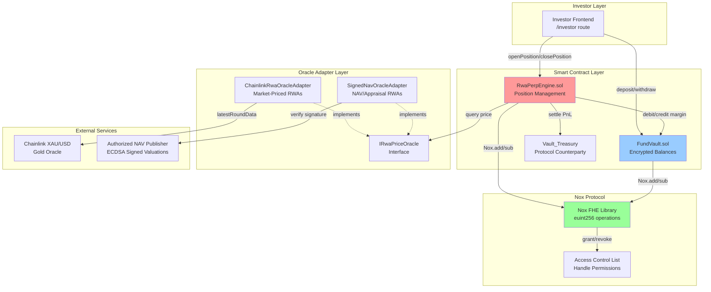
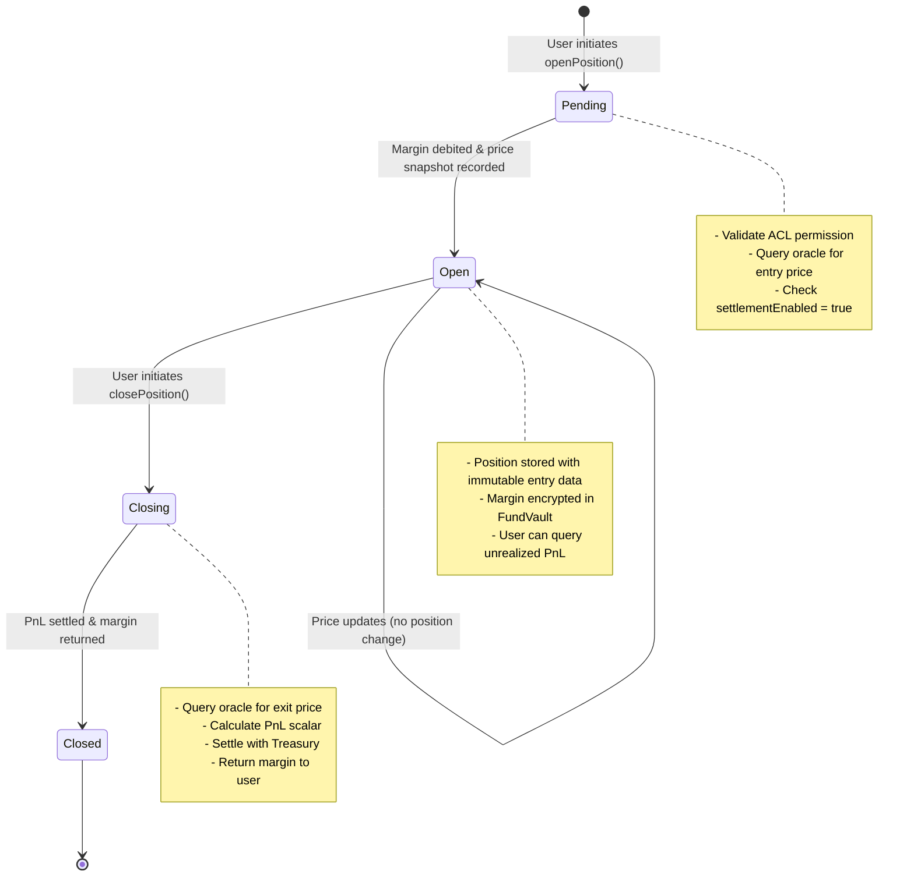
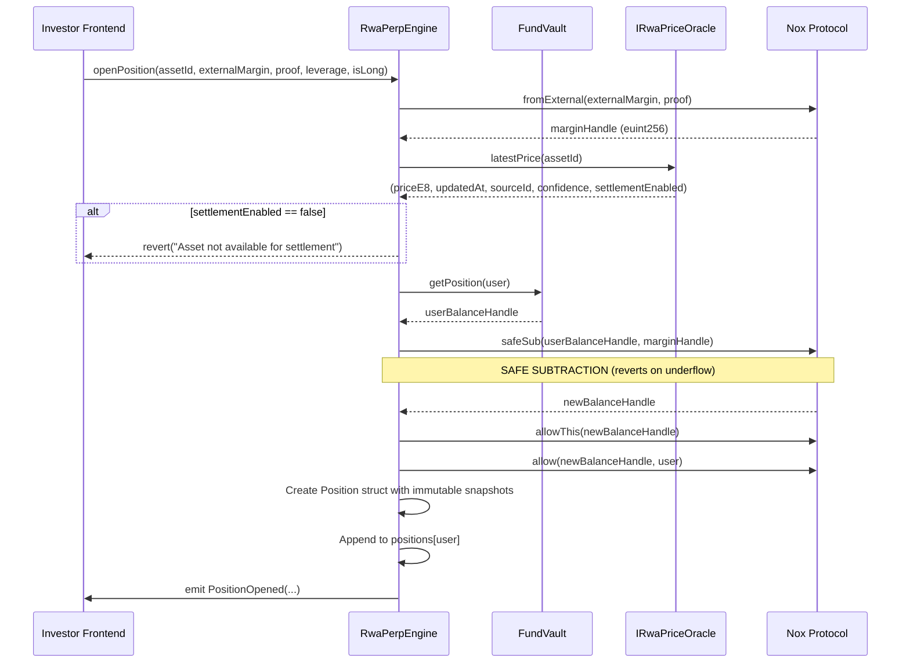
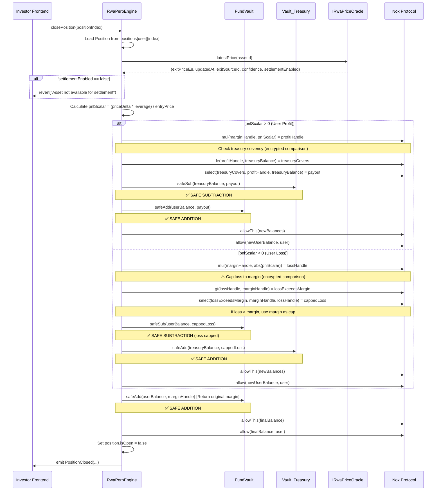
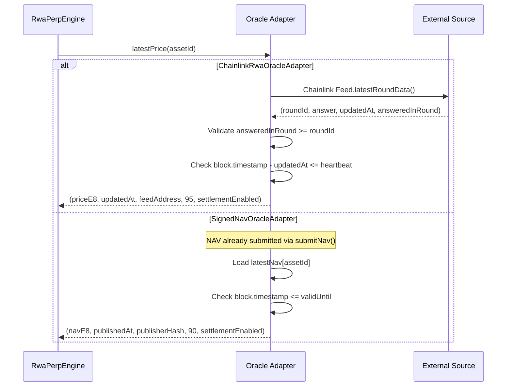
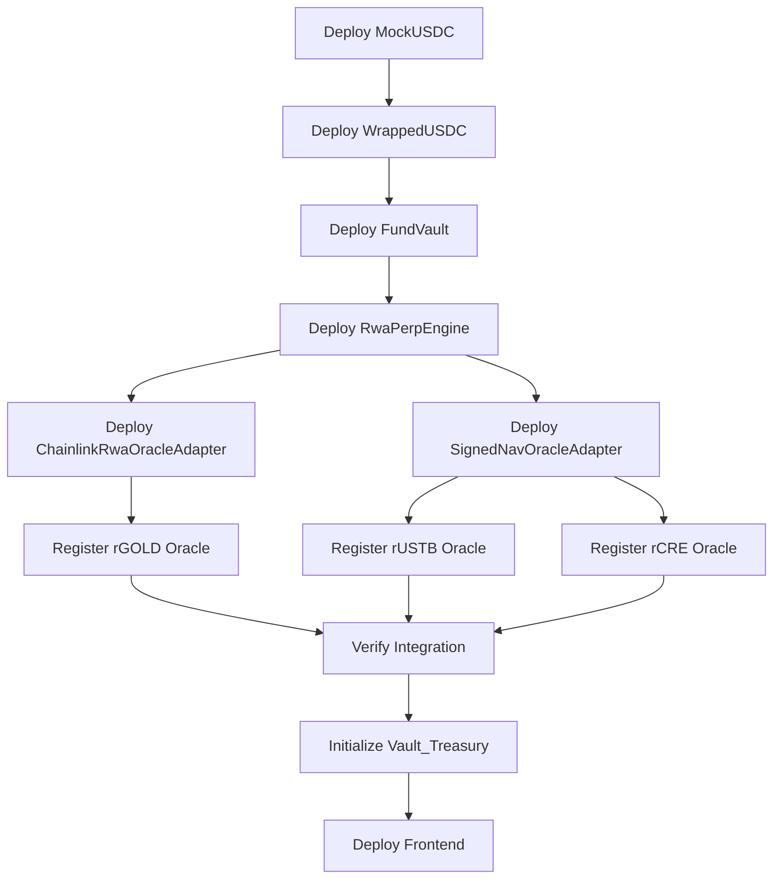
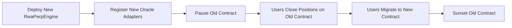

# Design Document: Confidential RWA Perpetual Engine

## Overview

⚠️ **CRITICAL SECURITY WARNINGS** ⚠️

Before implementing this design in Solidity, developers MUST understand these FHE-specific security requirements:

### 1. **NEVER Use Bare Nox.add() or Nox.sub()**
- ❌ `Nox.add()` and `Nox.sub()` silently overflow/underflow within encrypted ring
- ✅ `Nox.safeAdd()` and `Nox.safeSub()` revert on overflow using encrypted comparisons
- **All balance arithmetic MUST use safe functions** to prevent balance corruption

### 2. **ALWAYS Validate Balance Before safeSub()**
- ❌ `Nox.safeSub()` DOES NOT REVERT — saturates to zero silently (prevents side-channel leaks)
- ✅ Use `Nox.ge(balance, amount)` to check sufficient balance BEFORE subtraction
- ✅ `require(Nox.ge(...), "Insufficient balance")` for explicit validation
- **safeSub() returns zero on underflow without reverting** per ERC-7984 spec

### 3. **ALWAYS Cap Losses to Position Margin**
- Without liquidation engine, 10x leverage + 10%+ adverse price = loss exceeds margin
- Use `Nox.select(lossExceedsMargin, marginHandle, lossHandle)` to cap loss
- **Never attempt to debit more than deposited margin** via `safeSub()`

### 4. **ALWAYS Use Encrypted Branching**
- ❌ Never decrypt for comparisons — breaks privacy and enables side-channel attacks
- ✅ `Nox.le()`, `Nox.gt()` return encrypted `ebool` for comparisons
- ✅ `Nox.select(condition, ifTrue, ifFalse)` for constant-time branching
- **Treasury solvency checks MUST use encrypted comparison**, not explicit reverts

### 5. **NEVER Grant Blanket Auditor Access**
- ❌ No global `disclosureManager` with automatic access to all investor data
- ✅ Query per-user ACLs via `IDisclosureManager.getAuthorizedAuditors(user)`
- **Each investor opts in to grant specific auditors access** to their positions

### 6. **See Implementation Notes Section for Complete Patterns**
- Refer to "Nox FHE Safe Arithmetic Patterns" for correct usage examples
- Review "_settlePnL Implementation" for complete loss capping + treasury solvency logic

---

The Confidential RWA Perpetual Engine (RealVault) enables institutional investors to gain leveraged synthetic exposure to real-world assets through perpetual positions while maintaining full privacy via iExec Nox FHE encryption. The system implements a pluggable oracle architecture where each RWA asset class uses verified price sources matching its genuine valuation methodology rather than crypto price feeds proxying as RWA assets.

### Core Principles

1. **Cryptographic Privacy**: All collateral balances and position margins remain encrypted on-chain as euint256 handles; plaintext values never exposed
2. **Verifiable Pricing**: Immutable price snapshots with source verification prevent post-hoc manipulation
3. **Asset-Class-Specific Oracles**: Market-priced RWAs use Chainlink, NAV-priced use signed valuations from authorized publishers
4. **Protocol Counterparty**: Vault_Treasury absorbs all position PnL without external liquidity providers
5. **Sovereign Multi-Wallet State**: 10,000+ wallets with cryptographically isolated positions via Nox ACL

### Design Goals

- Enable leveraged (1x-10x) long/short positions on rGOLD (market-priced), rUSTB (NAV-priced), rCRE (appraisal-priced)
- Integrate seamlessly with existing FundVault encrypted balance system
- Support asset-specific settlement cadences (intraday for rGOLD, daily for rUSTB, weekly/monthly for rCRE)
- Maintain audit trails with immutable entry/exit price snapshots
- Deploy on Sepolia testnet with production-ready oracle adapter architecture

### System Context

RwaPerpEngine integrates with:
- **FundVault**: Manages encrypted mUSDC balances (ERC-7984 confidential vault)
- **Nox Protocol**: Provides FHE computation (add, sub, fromExternal, allowThis, allow)
- **Oracle Adapters**: Pluggable IRwaPriceOracle implementations per asset class
- **Investor Frontend**: Trading panel at /investor route for position management
- **DisclosureManager**: Audit access control for compliance decryption (optional integration)


## Architecture

### High-Level Component Diagram



### Contract Architecture

#### 1. RwaPerpEngine.sol (Main Contract)

**Responsibilities:**
- Store and manage perpetual positions per user
- Debit encrypted margin from FundVault on position open
- Query oracle adapters for verified price data
- Calculate PnL on position close
- Settle profits/losses with Vault_Treasury
- Emit position lifecycle events for indexing

**State Variables:**
```solidity
mapping(address => Position[]) public positions;
mapping(bytes32 => address) public oracleAdapters;  // assetId => adapter address
address public fundVault;
address public vaultTreasury;
address public disclosureManagerContract;  // Per-user ACL authorization service
uint8 public constant MAX_LEVERAGE = 10;
```


#### 2. IRwaPriceOracle.sol (Interface)

**Responsibilities:**
- Define standard interface for all oracle adapters
- Return price with metadata (source, confidence, settlement status)

**Interface Definition:**
```solidity
interface IRwaPriceOracle {
    function latestPrice(bytes32 assetId) external view returns (
        uint256 priceE8,           // Price in 8 decimals (e.g., $1,850.25 = 185025000000)
        uint256 updatedAt,          // Timestamp of price publication
        bytes32 sourceId,           // Immutable source identifier
        uint8 confidence,           // Confidence score (0-100)
        bool settlementEnabled      // Whether trading is currently allowed
    );
}
```

#### 3. ChainlinkRwaOracleAdapter.sol (Market-Priced RWAs)

**Responsibilities:**
- Query Chainlink AggregatorV3Interface for rGOLD (XAU/USD or gold-specific feed)
- Validate answeredInRound >= roundId to detect stale rounds
- Check updatedAt against heartbeat window
- Return sourceId containing feed contract address

**Core Logic:**
```solidity
function latestPrice(bytes32 assetId) external view returns (...) {
    AggregatorV3Interface feed = feeds[assetId];
    (uint80 roundId, int256 answer, , uint256 updatedAt, uint80 answeredInRound) = 
        feed.latestRoundData();
    
    // Chainlink staleness validations
    require(answeredInRound >= roundId, "Stale round data");
    require(answeredInRound > 0, "Invalid round");
    require(answer > 0, "Invalid price");
    require(block.timestamp - updatedAt <= heartbeat, "Price too old");
    
    bool settlementEnabled = (block.timestamp - updatedAt <= heartbeat);
    bytes32 sourceId = bytes32(uint256(uint160(address(feed))));
    
    return (uint256(answer), updatedAt, sourceId, 95, settlementEnabled);
}
```


#### 4. SignedNavOracleAdapter.sol (NAV/Appraisal-Priced RWAs)

**Responsibilities:**
- Accept ECDSA-signed NAV submissions from authorized publishers
- Verify signature authenticity on-chain
- Enforce monotonic nonce to prevent replay attacks
- Enable settlement only during valid time windows

**Core Logic:**
```solidity
struct NavSubmission {
    uint256 navE8;
    uint256 publishedAt;
    uint256 validUntil;
    uint256 nonce;
    bytes signature;
}

mapping(bytes32 => address) public authorizedPublishers;  // assetId => publisher address
mapping(bytes32 => NavSubmission) public latestNav;
mapping(bytes32 => uint256) public lastNonce;

function submitNav(bytes32 assetId, NavSubmission calldata nav) external {
    require(nav.nonce > lastNonce[assetId], "Nonce must increase");
    
    // Reconstruct message hash for ECDSA verification
    bytes32 messageHash = keccak256(abi.encodePacked(
        assetId, nav.navE8, nav.publishedAt, nav.validUntil, nav.nonce
    ));
    bytes32 ethSignedHash = keccak256(abi.encodePacked("\x19Ethereum Signed Message:\n32", messageHash));
    
    address signer = ECDSA.recover(ethSignedHash, nav.signature);
    require(signer == authorizedPublishers[assetId], "Unauthorized publisher");
    
    latestNav[assetId] = nav;
    lastNonce[assetId] = nav.nonce;
    
    emit NavSubmitted(assetId, nav.navE8, nav.publishedAt, nav.validUntil, nav.nonce);
}

function latestPrice(bytes32 assetId) external view returns (...) {
    NavSubmission memory nav = latestNav[assetId];
    require(nav.navE8 > 0, "No NAV available");
    
    bool settlementEnabled = (block.timestamp >= nav.publishedAt && block.timestamp <= nav.validUntil);
    bytes32 sourceId = keccak256(abi.encodePacked("SignedNAV", authorizedPublishers[assetId]));
    
    return (nav.navE8, nav.publishedAt, sourceId, 90, settlementEnabled);
}
```

### Oracle Adapter Registry

**Registration Flow:**
1. Admin calls `registerOracleAdapter(bytes32 assetId, address adapter)`
2. RwaPerpEngine validates adapter implements IRwaPriceOracle
3. Emits `OracleAdapterRegistered(assetId, adapter)` event
4. Future position open/close calls query registered adapter

**Asset Configuration:**
- `rGOLD` → ChainlinkRwaOracleAdapter (XAU/USD feed with 1-hour heartbeat)
- `rUSTB` → SignedNavOracleAdapter (daily NAV, 24-hour validity)
- `rCRE` → SignedNavOracleAdapter (weekly appraisal, 7-day validity)


## Components and Interfaces

### Position Struct

```solidity
struct Position {
    bytes32 assetId;              // Asset identifier (rGOLD, rUSTB, rCRE)
    euint256 marginHandle;        // Encrypted collateral handle (never decrypted on-chain)
    uint128 entryPriceE8;         // Immutable entry price snapshot (8 decimals)
    uint80 entryRoundOrNonce;     // Chainlink roundId or signed NAV nonce at entry
    bytes32 entrySourceId;        // Oracle source identifier at entry (immutable)
    uint8 leverage;               // Leverage multiplier (1x-10x)
    uint64 openedAt;              // Position open timestamp
    bool isLong;                  // true = long, false = short
    bool isOpen;                  // Position status flag
}
```

**Design Rationale:**
- `marginHandle` is encrypted to prevent competitor surveillance
- `entryPriceE8`, `entryRoundOrNonce`, `entrySourceId` are immutable snapshots preventing post-hoc manipulation
- 8-decimal precision balances human readability ($1,850.25) with computational precision
- Position size is calculated as `marginPlaintext * leverage` (derived, not stored)

### FundVault Integration Interface

RwaPerpEngine interacts with FundVault via these patterns:

```solidity
interface IFundVault {
    function getPosition(address investor) external view returns (euint256);
}

// Usage in RwaPerpEngine
function _debitMargin(address user, euint256 marginAmount) internal {
    euint256 userBalance = IFundVault(fundVault).getPosition(user);
    
    // ⚠️ EXPLICIT VALIDATION: Check sufficient balance BEFORE subtraction
    ebool hasSufficientBalance = Nox.ge(userBalance, marginAmount);
    require(hasSufficientBalance, "Insufficient margin balance");
    
    euint256 newBalance = Nox.safeSub(userBalance, marginAmount);  // ✅ SAFE SUBTRACTION
    // safeSub saturates to zero if insufficient, but we already validated
    
    // Grant ACL permissions
    Nox.allowThis(newBalance);
    Nox.allow(newBalance, user);
    
    // Update FundVault with new balance
    IFundVault(fundVault).updatePosition(user, newBalance);
    
    // Note: FundVault must grant RwaPerpEngine ACL permission via Nox.allow()
}

function _creditBalance(address user, euint256 creditAmount) internal {
    euint256 userBalance = IFundVault(fundVault).getPosition(user);
    euint256 newBalance = Nox.safeAdd(userBalance, creditAmount);  // ✅ SAFE ADDITION
    
    // Grant ACL permissions
    Nox.allowThis(newBalance);
    Nox.allow(newBalance, user);
    
    // Update FundVault with new balance
    IFundVault(fundVault).updatePosition(user, newBalance);
}
```

**Critical Constraint**: Users must call `Nox.allow(balanceHandle, address(RwaPerpEngine))` before opening positions to grant computation permission.

### Per-Investor ACL Model

**CRITICAL: ACLs are per-investor, not global.** Each investor controls which auditors can view their positions. The RwaPerpEngine queries the DisclosureManager for user-specific authorized auditors.

```solidity
// REMOVED: Global disclosureManager address
// address public disclosureManager;  // ❌ INCORRECT: Global auditor access

// NEW: Per-user ACL query
address public disclosureManagerContract;  // ✅ CORRECT: Per-user authorization service

function _updateUserBalance(address user, euint256 newBalance) internal {
    // Always grant contract and user access
    Nox.allowThis(newBalance);
    Nox.allow(newBalance, user);

    // Query DisclosureManager for user-authorized auditors
    if (disclosureManagerContract != address(0)) {
        address[] memory authorizedAuditors = 
            IDisclosureManager(disclosureManagerContract).getAuthorizedAuditors(user);
        
        for (uint i = 0; i < authorizedAuditors.length; i++) {
            Nox.allow(newBalance, authorizedAuditors[i]);
        }
    }
}

interface IDisclosureManager {
    function getAuthorizedAuditors(address investor) external view returns (address[] memory);
}
```

**Design Rationale:**
- Each investor opts in to grant specific auditors access to their positions
- No global auditor with blanket access to all investor data
- Preserves "opt-in per investor" privacy model from requirements
- DisclosureManager maintains per-user auditor authorization lists

### Nox FHE Safe Arithmetic Patterns

⚠️ **CRITICAL SECURITY WARNING** ⚠️

**FHE operations do NOT expose plaintext for overflow checks** — bare `Nox.add()` and `Nox.sub()` silently wrap around within the encrypted ring. The Nox SDK provides safe arithmetic primitives that protect against overflow/underflow using encrypted comparisons without decryption.

⚠️ **CRITICAL: Nox.safeSub() DOES NOT REVERT ON UNDERFLOW** ⚠️

Per ERC-7984 specification, `Nox.safeSub()` **saturates to zero silently** when balance < amount to prevent side-channel balance leaks via revert patterns. This is BY DESIGN.

**ALWAYS validate sufficient balance explicitly BEFORE subtraction:**

```solidity
// ✅ CORRECT: Check balance BEFORE subtraction
ebool hasSufficientBalance = Nox.ge(userBalance, marginHandle);
require(hasSufficientBalance, "Insufficient margin balance"); // Revert on plaintext derived flag

euint256 newBalance = Nox.safeSub(userBalance, marginHandle);
// safeSub won't revert, but we've already validated above
```

**ALWAYS use these safe functions:**
1. `Nox.safeAdd(euint256 a, euint256 b)` → Reverts on overflow via side-channel-free encrypted comparison
2. `Nox.safeSub(euint256 a, euint256 b)` → **Saturates to zero on underflow WITHOUT reverting** (prevents side-channel leaks)
3. `Nox.ge(euint256 a, euint256 b) → ebool` → Encrypted greater-than-or-equal comparison for explicit validation
4. `Nox.select(ebool condition, euint256 ifTrue, euint256 ifFalse)` → Constant-time branching without decryption
5. `Nox.le(euint256 a, euint256 b) → ebool` → Encrypted less-than-or-equal comparison
6. `Nox.gt(euint256 a, euint256 b) → ebool` → Encrypted greater-than comparison

⚠️ **NEVER USE BARE NOX.ADD() OR NOX.SUB()** ⚠️
- These functions silently overflow/underflow within the encrypted ring
- No revert on overflow — just wrapped values that break balance invariants
- Use `Nox.safeAdd()` and `Nox.safeSub()` exclusively in all production code

**Pattern 1: Accepting Encrypted Input from Frontend**
```solidity
function openPosition(
    bytes32 assetId,
    externalEuint256 externalMargin,
    bytes calldata inputProof,
    uint8 leverage,
    bool isLong
) external {
    // Convert external encrypted input to internal handle
    euint256 marginHandle = Nox.fromExternal(externalMargin, inputProof);
    // ... rest of position opening logic
}
```

**Pattern 2: Safe Arithmetic with Encrypted Handles**
```solidity
// Debit margin from user (SAFE SUBTRACTION)
euint256 oldBalance = positions[user];
euint256 newBalance = Nox.safeSub(oldBalance, marginHandle);  // ✅ SAFE: Reverts on underflow
// euint256 newBalance = Nox.sub(oldBalance, marginHandle);   // ❌ UNSAFE: Silent underflow

// Credit profit to user (SAFE ADDITION)
euint256 profitHandle = Nox.toEuint256(profitAmount);  // Convert plaintext PnL to encrypted
euint256 updatedBalance = Nox.safeAdd(newBalance, profitHandle);  // ✅ SAFE: Reverts on overflow
// euint256 updatedBalance = Nox.add(newBalance, profitHandle);  // ❌ UNSAFE: Silent overflow
```

**Pattern 3: Encrypted Branching with select()**
```solidity
// Cap loss to margin without decryption
euint256 lossHandle = _scaledAmount(marginHandle, uint256(-pnlScalar));
ebool lossExceedsMargin = Nox.gt(lossHandle, marginHandle);
euint256 cappedLoss = Nox.select(lossExceedsMargin, marginHandle, lossHandle);
// If lossHandle > margin, use margin; otherwise use lossHandle

// Treasury solvency check without decryption
ebool treasuryCovers = Nox.le(profitHandle, treasuryBalance);
euint256 payout = Nox.select(treasuryCovers, profitHandle, treasuryBalance);
// If treasury insufficient, pay what's available
```

**Pattern 4: ACL Management After Operations**
```solidity
// After every Nox.safeAdd or Nox.safeSub, grant contract access to new handle
Nox.allowThis(newBalance);

// After balance updates, grant user decryption access
Nox.allow(newBalance, user);

// Query per-user authorized auditors (NOT global disclosure manager)
if (disclosureManagerContract != address(0)) {
    address[] memory authorizedAuditors = 
        IDisclosureManager(disclosureManagerContract).getAuthorizedAuditors(user);
    for (uint i = 0; i < authorizedAuditors.length; i++) {
        Nox.allow(newBalance, authorizedAuditors[i]);
    }
}
```


### PnL Calculation Logic

**PnL Calculation — Correct Approach:**

The system calculates PnL by applying a scalar to the encrypted margin. **The scalar DOES multiply by leverage (correctly)**, but applies to margin once, not to size twice.

**Mathematical Flow:**
1. Position notional size = margin × leverage (implicit, not stored)
2. PnL in absolute terms = (price_delta / entry_price) × margin × leverage
3. We compute `pnlScalar = (price_delta × leverage) / entry_price` as a percentage
4. Then apply scalar to encrypted margin: `pnlAmount = margin × pnlScalar`
5. **This IS multiplication by leverage (correctly)**, but applied to margin once, not to size twice

**Implementation:**
```solidity
function _calculatePnL(
    Position memory pos,
    uint256 exitPriceE8
) internal pure returns (int256 pnlScalar) {
    // Calculate price delta based on position direction
    int256 priceDelta;
    if (pos.isLong) {
        priceDelta = int256(exitPriceE8) - int256(pos.entryPriceE8);
    } else {
        priceDelta = int256(pos.entryPriceE8) - int256(exitPriceE8);
    }
    
    // PnL scalar = (priceDelta × leverage) / entryPrice
    // This DOES multiply by leverage, which is correct
    // The scalar is applied to encrypted margin to get final PnL
    // Result is in basis points (1e8 = 100%)
    int256 pnlScalar = (priceDelta * int256(uint256(pos.leverage)) * 1e8) / int256(pos.entryPriceE8);
    
    return pnlScalar;
}

// Helper: Apply PnL scalar to encrypted margin
function _scaledAmount(euint256 baseHandle, uint256 scalarE8) internal pure returns (euint256) {
    // Multiply encrypted value by plaintext scalar
    // scalarE8 is in basis points (e.g., 5000 = 50%)
    return Nox.mul(baseHandle, scalarE8 / 1e8);  // Nox handles encrypted × plaintext
}
```

**CORRECTION:** **Previous documentation incorrectly stated "does NOT multiply by leverage"**. The code **correctly multiplies by leverage exactly once** in the scalar calculation. This scalar is then applied to the margin handle via encrypted multiplication.

**Important Notes:**
- PnL calculation happens in plaintext using oracle prices (not encrypted)
- The scalar is computed as a percentage/multiplier in basis points (1e8 scale)
- Only when applying scalar to margin do we use encrypted arithmetic via `Nox.mul()`
- This preserves privacy of margin amount while using verifiable public prices

### Treasury Counterparty Model with Loss Capping

⚠️ **CRITICAL SECURITY FIX: Loss Capping to Prevent Negative Balances** ⚠️

**Problem:** Without a liquidation engine, 10x leverage combined with adverse price movements exceeding 10% can result in losses greater than the deposited margin, causing `safeSub()` to attempt to debit more than the user's balance, resulting in transaction revert or negative balance vulnerabilities.

**Solution:** Cap losses at the position margin using encrypted comparison, ensuring the system never attempts to debit more than was deposited for that specific position.

**Treasury Balance Management:**

```solidity
address public vaultTreasury;  // Protocol-owned treasury address
euint256 private treasuryBalance;  // Encrypted treasury collateral

function _settlePnL(
    address user,
    int256 pnlScalar,        // Plaintext percentage from oracle calculation (basis points)
    euint256 marginHandle    // Encrypted margin for THIS position
) internal {
    euint256 userBalance = IFundVault(fundVault).getPosition(user);

    if (pnlScalar > 0) {
        // USER PROFIT: Treasury pays user
        euint256 profitHandle = _scaledAmount(marginHandle, uint256(pnlScalar));

        // ⚠️ EXPLICIT VALIDATION: Check treasury solvency BEFORE subtraction
        ebool treasuryCovers = Nox.ge(treasuryBalance, profitHandle);
        
        if (!treasuryCovers) {
            // Handle treasury insolvency explicitly
            revert("Treasury insufficient funds");
            // OR use graceful degradation with select (alternative approach)
        }
        
        euint256 payout = Nox.select(treasuryCovers, profitHandle, treasuryBalance);
        // If treasury covers, pay profit; otherwise pay available balance

        treasuryBalance = Nox.safeSub(treasuryBalance, payout);  // ✅ SAFE
        // safeSub won't revert, but we validated above
        Nox.allowThis(treasuryBalance);

        euint256 newUserBalance = Nox.safeAdd(userBalance, payout);  // ✅ SAFE
        Nox.allowThis(newUserBalance);
        Nox.allow(newUserBalance, user);

        _updateUserBalance(user, newUserBalance);

    } else if (pnlScalar < 0) {
        // USER LOSS: Cap loss to margin deposited in THIS position
        euint256 lossHandle = _scaledAmount(marginHandle, uint256(-pnlScalar));

        // ⚠️ CRITICAL: Never debit more than margin for this position
        ebool lossExceedsMargin = Nox.gt(lossHandle, marginHandle);
        euint256 cappedLoss = Nox.select(lossExceedsMargin, marginHandle, lossHandle);
        // If calculated loss > margin, use margin as maximum loss
        // If calculated loss <= margin, use calculated loss
        
        // ⚠️ EXPLICIT VALIDATION: Check sufficient balance BEFORE subtraction
        ebool hasSufficientBalance = Nox.ge(userBalance, cappedLoss);
        require(hasSufficientBalance, "Insufficient balance for loss");

        euint256 newUserBalance = Nox.safeSub(userBalance, cappedLoss);  // ✅ SAFE
        // safeSub saturates to zero if insufficient, but we validated
        Nox.allowThis(newUserBalance);
        Nox.allow(newUserBalance, user);

        treasuryBalance = Nox.safeAdd(treasuryBalance, cappedLoss);  // ✅ SAFE
        Nox.allowThis(treasuryBalance);

        _updateUserBalance(user, newUserBalance);
    }
    // pnlScalar == 0: no settlement, closePosition returns margin only
}

// Helper function to scale encrypted amount by plaintext percentage
function _scaledAmount(euint256 baseHandle, uint256 scalarE8) internal pure returns (euint256) {
    // Multiply encrypted value by plaintext scalar
    // scalarE8 is in basis points (e.g., 5000 = 0.5 = 50%)
    euint256 scaledValue = Nox.mul(baseHandle, scalarE8);  // Nox handles encrypted × plaintext
    euint256 denominator = Nox.toEuint256(1e8);            // Scale factor
    return Nox.div(scaledValue, denominator);              // Result: baseHandle × (scalarE8 / 1e8)
}
```

**Loss Capping Design Rationale:**
- Without liquidation engine, a 10%+ adverse price movement with 10x leverage exceeds deposited margin
- Loss capping prevents `safeSub()` from attempting to debit more than user balance
- **Loss cap = margin deposited in THIS position** (not total user balance across all positions)
- Treasury solvency checked via encrypted comparison (`Nox.le`), no decryption required
- If treasury insufficient for profit payout, `Nox.select()` enables graceful degradation (partial payout)
- **No explicit revert** for treasury insufficiency — privacy-preserving design uses encrypted branching

**Key Security Properties:**
1. **Loss cannot exceed margin**: `Nox.select(lossExceedsMargin, marginHandle, lossHandle)` enforces hard cap
2. **No negative balances**: `safeSub()` with capped loss ensures sufficient balance
3. **Privacy preserved**: Loss cap computed via encrypted comparison, no decryption needed
4. **Per-position isolation**: Loss cap applies to individual position margin, not total portfolio


## Data Models

### Asset Configuration Registry

```solidity
struct AssetConfig {
    bytes32 assetId;              // Asset identifier (keccak256("rGOLD"))
    string symbol;                // Human-readable symbol
    address oracleAdapter;        // IRwaPriceOracle implementation
    uint256 maxStaleness;         // Maximum acceptable price age (seconds)
    string valuationMethod;       // "Market", "NAV", "Appraisal"
    string description;           // "Tokenized Gold", "US Treasury Bills", etc.
}

mapping(bytes32 => AssetConfig) public assetConfigs;
```

**Example Configurations:**
```solidity
// rGOLD - Market-priced with intraday updates
AssetConfig({
    assetId: keccak256("rGOLD"),
    symbol: "rGOLD",
    oracleAdapter: 0x123...,  // ChainlinkRwaOracleAdapter
    maxStaleness: 3600,       // 1 hour
    valuationMethod: "Market",
    description: "Tokenized gold backed by physical reserves"
})

// rUSTB - NAV-priced with daily updates
AssetConfig({
    assetId: keccak256("rUSTB"),
    symbol: "rUSTB",
    oracleAdapter: 0x456...,  // SignedNavOracleAdapter
    maxStaleness: 86400,      // 24 hours
    valuationMethod: "NAV",
    description: "US Treasury Bill fund shares"
})

// rCRE - Appraisal-priced with weekly updates
AssetConfig({
    assetId: keccak256("rCRE"),
    symbol: "rCRE",
    oracleAdapter: 0x789...,  // SignedNavOracleAdapter
    maxStaleness: 604800,     // 7 days
    valuationMethod: "Appraisal",
    description: "Commercial real estate fund shares"
})
```

### Event Definitions

```solidity
event PositionOpened(
    address indexed user,
    uint256 indexed positionIndex,
    bytes32 indexed assetId,
    bool isLong,
    uint8 leverage,
    uint128 entryPriceE8,
    uint80 entryRoundOrNonce,
    bytes32 entrySourceId,
    uint64 timestamp
);

event PositionClosed(
    address indexed user,
    uint256 indexed positionIndex,
    bytes32 indexed assetId,
    uint128 exitPriceE8,
    bytes32 exitSourceId,
    int256 pnlScalar,
    uint64 timestamp
);

event OracleAdapterRegistered(
    bytes32 indexed assetId,
    address indexed adapter,
    string valuationMethod
);

event MarginDebited(
    address indexed user,
    euint256 marginHandle
);

event PnLSettled(
    address indexed user,
    int256 pnlScalar,
    bool isProfit
);
```


### Position Lifecycle State Machine



### Data Flow: Position Opening




### Data Flow: Position Closing with PnL Settlement



### Oracle Adapter Query Flow




## Correctness Properties

*A property is a characteristic or behavior that should hold true across all valid executions of a system—essentially, a formal statement about what the system should do. Properties serve as the bridge between human-readable specifications and machine-verifiable correctness guarantees.*

### Property 1: Position Creation Completeness

*For any* valid position parameters (assetId, margin, leverage, direction), when a position is created, the resulting Position struct SHALL contain all required fields: assetId, marginHandle (euint256), entryPriceE8, entryRoundOrNonce, entrySourceId, leverage, openedAt, isLong, and isOpen set to true.

**Validates: Requirements 1.2, 7.5**

### Property 2: Multiple Concurrent Positions

*For any* user address, opening N positions SHALL result in the positions array for that user having length N, with each position independently addressable by index.

**Validates: Requirements 1.3, 7.6**

### Property 3: Position Close State Transition

*For any* open position (where isOpen = true), when the position is closed, the isOpen flag SHALL transition to false and remain false thereafter.

**Validates: Requirements 1.4, 8.9**

### Property 4: Entry Snapshot Immutability

*For any* position, after creation, the entry snapshot fields (entryPriceE8, entryRoundOrNonce, entrySourceId) SHALL remain unchanged regardless of subsequent contract operations or oracle price updates.

**Validates: Requirements 1.5**

### Property 5: Oracle Adapter Routing

*For any* assetId with a registered oracle adapter, when querying price data, the RwaPerpEngine SHALL route the query to the configured adapter's latestPrice() function and SHALL NOT accept price data from unregistered sources.

**Validates: Requirements 3.3, 7.3, 8.2**

### Property 6: Chainlink Round Freshness Validation

*For any* Chainlink oracle response, the ChainlinkRwaOracleAdapter SHALL enforce answeredInRound >= roundId, rejecting any response where answeredInRound < roundId as stale round data.

**Validates: Requirements 4.5**

### Property 7: Chainlink Heartbeat Staleness Detection

*For any* configured heartbeat window H and Chainlink oracle response with updatedAt timestamp T, if (block.timestamp - T) > H, then settlementEnabled SHALL be false and position operations SHALL be rejected.

**Validates: Requirements 4.7, 4.8**

### Property 8: Chainlink Source Identification

*For any* Chainlink feed with contract address A, the sourceId returned by ChainlinkRwaOracleAdapter SHALL equal bytes32(uint256(uint160(A))), enabling verifiable source tracing.

**Validates: Requirements 4.9**

### Property 9: Signed NAV Signature Verification

*For any* NAV submission with signature S for assetId A, the SignedNavOracleAdapter SHALL accept the submission if and only if ECDSA.recover(messageHash, S) equals authorizedPublishers[A], rejecting all unauthorized signatures.

**Validates: Requirements 5.4**

### Property 10: Signed NAV Nonce Monotonicity

*For any* assetId A with last accepted nonce N, the SignedNavOracleAdapter SHALL reject NAV submissions with nonce <= N and SHALL accept submissions with nonce > N, enforcing strict monotonic increase to prevent replay attacks.

**Validates: Requirements 5.5**

### Property 11: Signed NAV Time Window Validation

*For any* NAV submission with publishedAt P and validUntil V, settlementEnabled SHALL be true if and only if P <= block.timestamp <= V, preventing trading outside valid NAV windows.

**Validates: Requirements 5.6**

### Property 12: Signed NAV Source Identification

*For any* assetId A with authorized publisher P, the sourceId returned SHALL equal keccak256(abi.encodePacked("SignedNAV", P)), enabling cryptographic verification of NAV data provenance.

**Validates: Requirements 5.7**

### Property 13: Long Position PnL Calculation

*For any* long position with entryPriceE8 = E, exitPriceE8 = X, margin = M, and leverage = L, the PnL SHALL equal ((X - E) * M * L) / E, with positive values representing profit and negative values representing loss.

**Validates: Requirements 8.4**

### Property 14: Short Position PnL Calculation

*For any* short position with entryPriceE8 = E, exitPriceE8 = X, margin = M, and leverage = L, the PnL SHALL equal ((E - X) * M * L) / E, with positive values representing profit and negative values representing loss.

**Validates: Requirements 8.5**

### Property 15: Balance Round-Trip After Position Close

*For any* user with initial balance B0 who opens and closes a position with margin M and PnL = P, the final balance SHALL equal B0 - M + M + P = B0 + P, demonstrating margin is correctly returned and PnL is correctly applied.

**Validates: Requirements 2.3, 2.4, 8.6, 8.7, 8.8**

### Property 16: Treasury Debit on User Profit

*For any* profitable position with profit amount P, when the position is closed, the Vault_Treasury balance SHALL decrease by exactly P, maintaining zero-sum market mechanics.

**Validates: Requirements 9.2**

### Property 17: Treasury Credit on User Loss

*For any* losing position with loss amount L, when the position is closed, the Vault_Treasury balance SHALL increase by exactly L, maintaining zero-sum market mechanics.

**Validates: Requirements 9.3**

### Property 18: Multi-Wallet Position Isolation

*For any* two distinct wallet addresses A and B, operations on positions owned by A (opening, closing, modifying) SHALL NOT alter the positions array, balance, or any state variables associated with B, ensuring cryptographic isolation via Nox ACL.

**Validates: Requirements 15.4**

### Property 19: No Leverage Double-Multiplication

*For any* position with leverage L and margin M, the position size SHALL equal M * L, and PnL calculation SHALL use position size directly without multiplying by leverage again, preventing incorrect PnL amplification.

**Validates: Requirements 24.3**


## Error Handling

### Validation Hierarchy

The system implements defense-in-depth error handling with validation at multiple layers:

1. **Input Validation Layer**: Validate user inputs before state changes
2. **Oracle Validation Layer**: Validate price data freshness and authenticity
3. **ACL Permission Layer**: Verify Nox access control permissions
4. **Balance Sufficiency Layer**: Verify encrypted balances are sufficient
5. **State Consistency Layer**: Verify position state transitions are valid

### Error Conditions and Messages

#### Position Opening Errors

```solidity
// Insufficient balance - EXPLICIT VALIDATION REQUIRED
ebool hasSufficientBalance = Nox.ge(userBalance, marginAmount);
require(hasSufficientBalance, "Insufficient margin balance");
// Note: safeSub() won't revert - it saturates to zero silently

// No oracle configured
require(oracleAdapters[assetId] != address(0), "No oracle configured for asset");

// Oracle validation failures
require(priceE8 > 0, "Invalid oracle price");
require(block.timestamp - updatedAt <= maxStaleness, "Price data is stale");
require(settlementEnabled == true, "Asset not available for settlement at current time");

// ACL permission errors (handled by Nox protocol)
// Will revert with "Access denied" if user hasn't called Nox.allow()

// Leverage validation
require(leverage >= 1 && leverage <= MAX_LEVERAGE, "Invalid leverage value");
```

#### Position Closing Errors

```solidity
// Position validation
require(positionIndex < positions[msg.sender].length, "Position not found");
require(positions[msg.sender][positionIndex].isOpen, "Position already closed");

// Oracle validation (same as opening)
require(settlementEnabled == true, "Asset not available for settlement at current time");

// Treasury solvency (for winning positions)
// Explicit validation via Nox.ge() check
ebool treasuryCovers = Nox.ge(treasuryBalance, profitHandle);
if (!treasuryCovers) {
    revert("Treasury insufficient funds");
    // OR use graceful degradation with select()
}

// User balance sufficient for loss (explicit check)
ebool hasSufficientBalance = Nox.ge(userBalance, cappedLoss);
require(hasSufficientBalance, "Insufficient balance for loss");
```

#### Oracle Adapter Errors

```solidity
// ChainlinkRwaOracleAdapter
require(answeredInRound >= roundId, "Stale round data");
require(answeredInRound > 0, "Invalid round");
require(answer > 0, "Invalid price");
require(block.timestamp - updatedAt <= heartbeat, "Price too old");

// SignedNavOracleAdapter
require(nav.nonce > lastNonce[assetId], "Nonce must increase monotonically");
require(signer == authorizedPublishers[assetId], "Unauthorized NAV publisher");
require(nav.navE8 > 0, "Invalid NAV value");
require(block.timestamp <= nav.validUntil, "NAV expired");
```

### Error Recovery Patterns

#### Stale Oracle Fallback

When oracle data becomes stale, the system prevents new position actions rather than using potentially incorrect prices:

```solidity
function _validateOracleData(...) internal view {
    if (!settlementEnabled) {
        revert("Asset not available for settlement - wait for fresh oracle data");
    }
}
```

Users must wait for fresh oracle data before opening or closing positions. No automatic fallbacks to prevent price manipulation.

#### Treasury Insolvency Protection

If treasury cannot cover winning positions (unlikely edge case):

```solidity
// Encrypted comparison determines coverage
ebool treasuryCovers = Nox.le(profitHandle, treasuryBalance);
euint256 payout = Nox.select(treasuryCovers, profitHandle, treasuryBalance);
// If treasury insufficient, pays available balance (graceful degradation)

// safeSub() provides defense in depth if comparison bypassed
// Transaction atomically reverts if insufficient
// Manual intervention required to add treasury collateral
```

#### ACL Permission Recovery

If user revokes ACL permission while holding open positions:

```solidity
// User must re-grant permission before closing positions
// Positions remain safe (encrypted handles still valid)
// User can re-grant via: Nox.allow(balanceHandle, address(RwaPerpEngine))
```

### Revert Messages Design

All revert messages follow these principles:
- **Actionable**: Tell users what went wrong and how to fix it
- **Specific**: Distinguish between different error conditions
- **Gas-Efficient**: Use string literals stored in contract bytecode
- **Audit-Friendly**: Clear error traces in blockchain explorers


## Testing Strategy

### Dual Testing Approach

The system requires both **unit tests** for specific scenarios and **property-based tests** for universal correctness guarantees.

#### Unit Tests (Example-Based)

Unit tests focus on:
- **Specific Examples**: Concrete scenarios demonstrating correct behavior
- **Integration Points**: Interaction with FundVault, Nox, oracle adapters
- **Edge Cases**: Boundary conditions and error handling
- **Access Control**: ACL permission model verification

**Example Unit Test Structure:**
```javascript
describe("RwaPerpEngine - Position Opening", () => {
  it("should open long rGOLD position with 5x leverage", async () => {
    // Specific example with concrete values
    const margin = ethers.parseUnits("1000", 8); // $1000
    const leverage = 5;
    const assetId = ethers.id("rGOLD");
    
    // Test execution
    await rwaPerpEngine.openPosition(assetId, encryptedMargin, proof, leverage, true);
    
    // Assertions
    const position = await rwaPerpEngine.positions(user.address, 0);
    expect(position.leverage).to.equal(5);
    expect(position.isLong).to.be.true;
    expect(position.isOpen).to.be.true;
  });

  it("should reject position opening when oracle settlement disabled", async () => {
    // Edge case: settlement window closed
    await mockOracle.setSettlementEnabled(false);
    
    await expect(
      rwaPerpEngine.openPosition(assetId, encryptedMargin, proof, leverage, true)
    ).to.be.revertedWith("Asset not available for settlement");
  });
});
```

#### Property-Based Tests (PBT)

Property tests verify universal properties across randomized inputs.

**PBT Library**: Use `fast-check` (JavaScript/TypeScript) or `hypothesis` (Python) for test harness

**Test Configuration:**
- **Minimum 100 iterations** per property test (due to randomization)
- **Tag Format**: `// Feature: confidential-rwa-perp-engine, Property {number}: {property_text}`

**Example Property Test Structure:**
```javascript
const fc = require('fast-check');

describe("RwaPerpEngine - Correctness Properties", () => {
  // Feature: confidential-rwa-perp-engine, Property 2: Multiple Concurrent Positions
  it("Property 2: Multiple concurrent positions array growth", async () => {
    await fc.assert(
      fc.asyncProperty(
        fc.integer({ min: 1, max: 10 }), // N positions
        fc.array(fc.bigInt({ min: 100n, max: 10000n }), { minLength: 1, maxLength: 10 }), // margins
        async (numPositions, margins) => {
          // Setup fresh user for isolation
          const user = await ethers.Wallet.createRandom();
          
          // Open N positions
          for (let i = 0; i < numPositions && i < margins.length; i++) {
            await openPosition(user, margins[i]);
          }
          
          // Property assertion
          const positionCount = await rwaPerpEngine.getPositionCount(user.address);
          expect(positionCount).to.equal(Math.min(numPositions, margins.length));
        }
      ),
      { numRuns: 100 } // Minimum 100 iterations
    );
  });

  // Feature: confidential-rwa-perp-engine, Property 13: Long Position PnL Calculation
  it("Property 13: Long PnL = (exitPrice - entryPrice) * size", async () => {
    await fc.assert(
      fc.asyncProperty(
        fc.bigInt({ min: 100_00000000n, max: 3000_00000000n }), // Entry price $100-$3000
        fc.bigInt({ min: 100_00000000n, max: 3000_00000000n }), // Exit price
        fc.bigInt({ min: 100n, max: 10000n }), // Margin $1-$100
        fc.integer({ min: 1, max: 10 }), // Leverage
        async (entryPrice, exitPrice, margin, leverage) => {
          // Open long position
          await openLongPosition(entryPrice, margin, leverage);
          
          // Close at exit price
          const position = await getPosition(user, 0);
          const expectedPnL = ((exitPrice - entryPrice) * margin * leverage) / entryPrice;
          
          await closePosition(exitPrice);
          
          // Verify PnL matches calculation
          const actualBalance = await decryptBalance(user);
          const expectedBalance = initialBalance + expectedPnL;
          expect(actualBalance).to.be.closeTo(expectedBalance, tolerance);
        }
      ),
      { numRuns: 100 }
    );
  });
});
```

### Property Test Generators

**Custom Generators for Domain-Specific Data:**

```javascript
// Price generator (8 decimals, realistic range)
const priceGen = fc.bigInt({ 
  min: 1_00000000n,    // $1.00
  max: 100000_00000000n // $100,000
});

// Leverage generator
const leverageGen = fc.integer({ min: 1, max: 10 });

// Asset ID generator
const assetIdGen = fc.constantFrom(
  ethers.id("rGOLD"),
  ethers.id("rUSTB"),
  ethers.id("rCRE")
);

// Direction generator
const directionGen = fc.boolean(); // true = long, false = short

// Position generator (composite)
const positionGen = fc.record({
  assetId: assetIdGen,
  margin: fc.bigInt({ min: 100n, max: 100000n }),
  leverage: leverageGen,
  isLong: directionGen
});
```

### Integration Testing

**FundVault Integration:**
```javascript
describe("RwaPerpEngine + FundVault Integration", () => {
  it("should debit margin from FundVault on position open using safeSub", async () => {
    const initialBalance = await fundVault.getPosition(user.address);
    await rwaPerpEngine.openPosition(...);
    const finalBalance = await fundVault.getPosition(user.address);
    
    // Verify balance decreased by margin (encrypted comparison via TEE)
    const decryptedInitial = await decrypt(initialBalance);
    const decryptedFinal = await decrypt(finalBalance);
    expect(decryptedInitial - decryptedFinal).to.equal(margin);
  });

  it("should revert on insufficient balance via explicit ge() check", async () => {
    const userBalance = await fundVault.getPosition(user.address);
    const decryptedBalance = await decrypt(userBalance);
    
    // Attempt to open position with more margin than available
    const excessiveMargin = decryptedBalance + 1000n;
    
    await expect(
      rwaPerpEngine.openPosition(assetId, encryptMargin(excessiveMargin), proof, 5, true)
    ).to.be.revertedWith("Insufficient margin balance"); // From require(Nox.ge()), not safeSub()
  });
});
```

**Oracle Adapter Integration:**
```javascript
describe("ChainlinkRwaOracleAdapter Integration", () => {
  it("should fetch real Chainlink data on Sepolia testnet", async () => {
    // Use actual deployed Chainlink feed
    const sepoliaGoldFeed = "0x..."; // Real XAU/USD feed address
    const adapter = await deployChainlinkAdapter(sepoliaGoldFeed);
    
    const price = await adapter.latestPrice(ethers.id("rGOLD"));
    
    expect(price.priceE8).to.be.gt(0);
    expect(price.settlementEnabled).to.be.true;
    expect(price.sourceId).to.equal(ethers.zeroPadValue(sepoliaGoldFeed, 32));
  });
});
```

### Test Coverage Requirements

**Minimum Coverage Targets:**
- **Line Coverage**: 90%+ for RwaPerpEngine, oracle adapters
- **Branch Coverage**: 85%+ including all error paths
- **Property Coverage**: 100% of design properties implemented as PBT

**Coverage Exclusions:**
- Nox protocol internals (external dependency)
- FundVault contract (tested separately)
- Mock contracts (test doubles only)

### Testnet Deployment Verification

**Sepolia Deployment Checklist:**

1. **Contract Deployment:**
   ```bash
   npx hardhat run scripts/deploy-rwa-perp-engine.js --network sepolia
   ```

2. **Oracle Adapter Configuration:**
   ```javascript
   // Register ChainlinkRwaOracleAdapter for rGOLD
   await rwaPerpEngine.registerOracleAdapter(
     ethers.id("rGOLD"),
     chainlinkAdapterAddress
   );
   
   // Register SignedNavOracleAdapter for rUSTB and rCRE
   await rwaPerpEngine.registerOracleAdapter(
     ethers.id("rUSTB"),
     signedNavAdapterAddress
   );
   ```

3. **Integration Verification:**
   ```javascript
   // Verify FundVault integration
   const fundVaultAddress = await rwaPerpEngine.fundVault();
   console.log("FundVault:", fundVaultAddress);
   
   // Verify oracle adapters
   const rGoldOracle = await rwaPerpEngine.oracleAdapters(ethers.id("rGOLD"));
   console.log("rGOLD Oracle:", rGoldOracle);
   
   // Test price query
   const price = await IRwaPriceOracle__factory.connect(rGoldOracle, provider)
     .latestPrice(ethers.id("rGOLD"));
   console.log("Current rGOLD price:", ethers.formatUnits(price.priceE8, 8));
   ```

4. **Multi-Wallet Testing:**
   ```javascript
   // Test with 3 independent wallets
   const wallets = [wallet1, wallet2, wallet3];
   
   for (const wallet of wallets) {
     // Each wallet deposits, opens position, closes position
     await fundVault.connect(wallet).deposit(...);
     await rwaPerpEngine.connect(wallet).openPosition(...);
     await rwaPerpEngine.connect(wallet).closePosition(0);
   }
   
   // Verify position isolation
   const wallet1Positions = await rwaPerpEngine.getPositions(wallet1.address);
   const wallet2Positions = await rwaPerpEngine.getPositions(wallet2.address);
   expect(wallet1Positions.length).to.not.equal(wallet2Positions.length); // Independent state
   ```

### Continuous Integration

**CI Pipeline (GitHub Actions):**
```yaml
name: Test Suite
on: [push, pull_request]

jobs:
  unit-tests:
    runs-on: ubuntu-latest
    steps:
      - uses: actions/checkout@v3
      - name: Install dependencies
        run: npm install
      - name: Run unit tests
        run: npx hardhat test
      - name: Generate coverage
        run: npx hardhat coverage

  property-tests:
    runs-on: ubuntu-latest
    steps:
      - uses: actions/checkout@v3
      - name: Install dependencies
        run: npm install
      - name: Run property-based tests (100 iterations minimum)
        run: npx hardhat test test/properties/*.test.js
        env:
          PBT_ITERATIONS: 100

  integration-tests:
    runs-on: ubuntu-latest
    steps:
      - uses: actions/checkout@v3
      - name: Run integration tests against Sepolia fork
        run: npx hardhat test test/integration/*.test.js --network sepoliaFork
```

### Gas Optimization Testing

**Benchmarking Position Operations:**
```javascript
describe("Gas Usage Benchmarks", () => {
  it("should measure gas cost of position opening", async () => {
    const tx = await rwaPerpEngine.openPosition(...);
    const receipt = await tx.wait();
    console.log("Position Open Gas:", receipt.gasUsed.toString());
    
    // Target: < 500,000 gas for position open
    expect(receipt.gasUsed).to.be.lt(500000);
  });

  it("should measure gas cost of position closing", async () => {
    await rwaPerpEngine.openPosition(...);
    const tx = await rwaPerpEngine.closePosition(0);
    const receipt = await tx.wait();
    console.log("Position Close Gas:", receipt.gasUsed.toString());
    
    // Target: < 600,000 gas for position close (includes PnL settlement)
    expect(receipt.gasUsed).to.be.lt(600000);
  });
});
```


## Frontend Integration

### Investor Trading Panel Architecture

The trading interface resides at `/investor` route and implements asset-specific behavior based on valuation methodology.

#### Component Structure

```
/investor
  ├── TradingPanel.tsx              # Main container
  │   ├── AssetSelector.tsx         # rGOLD / rUSTB / rCRE picker
  │   ├── PositionForm.tsx          # Open position form
  │   │   ├── DirectionToggle.tsx   # Long/Short selector
  │   │   ├── LeverageSlider.tsx    # 1x-10x leverage
  │   │   └── MarginInput.tsx       # Encrypted margin input
  │   ├── OracleDisplay.tsx         # Asset-specific price display
  │   └── PositionTable.tsx         # Open positions with PnL
  └── hooks/
      ├── useOraclePrice.ts         # Real-time price updates
      ├── useEncryptedBalance.ts    # Nox FHE balance queries
      └── usePositionManagement.ts  # Open/close operations
```

#### Asset-Specific UI Behavior

**Market-Priced RWAs (rGOLD):**
```typescript
// OracleDisplay.tsx for rGOLD
const OracleDisplay = ({ assetId }: { assetId: string }) => {
  const { priceE8, updatedAt, sourceId, settlementEnabled } = useOraclePrice(assetId);
  
  if (assetId === ethers.id("rGOLD")) {
    return (
      <div className="oracle-display market-priced">
        <div className="price">
          <span className="label">Current Price</span>
          <span className="value">${formatPrice(priceE8, 8)}</span>
          <span className="unit">per oz</span>
        </div>
        
        <div className="metadata">
          <div className="source">
            <span className="label">Source:</span>
            <a href={getEtherscanLink(sourceId)} target="_blank">
              Chainlink {truncateAddress(sourceId)}
            </a>
          </div>
          
          <div className="freshness">
            <span className="label">Last Update:</span>
            <span className={getFreshnessClass(updatedAt)}>
              {formatDistanceToNow(updatedAt)} ago
            </span>
          </div>
          
          <div className="status">
            {settlementEnabled ? (
              <Badge variant="success">Trading Active</Badge>
            ) : (
              <Badge variant="warning">Stale Price - Trading Paused</Badge>
            )}
          </div>
        </div>
        
        {/* Intraday chart appropriate for market-priced assets */}
        <PriceChart assetId={assetId} timeframe="1H" />
      </div>
    );
  }
  // ... other asset types
};
```

**NAV-Priced RWAs (rUSTB):**
```typescript
// OracleDisplay.tsx for rUSTB
if (assetId === ethers.id("rUSTB")) {
  const { navE8, publishedAt, validUntil, publisherAddress } = useSignedNav(assetId);
  
  return (
    <div className="oracle-display nav-priced">
      <div className="price">
        <span className="label">Net Asset Value (NAV)</span>
        <span className="value">${formatPrice(navE8, 8)}</span>
        <span className="unit">per share</span>
      </div>
      
      <div className="metadata">
        <div className="publisher">
          <span className="label">Publisher:</span>
          <span className="value">{getPublisherName(publisherAddress)}</span>
          <VerifiedBadge address={publisherAddress} />
        </div>
        
        <div className="publication">
          <span className="label">Published:</span>
          <span className="value">{formatDate(publishedAt)}</span>
        </div>
        
        <div className="validity">
          <span className="label">Valid Until:</span>
          <span className="value">{formatDate(validUntil)}</span>
          {isWithinWindow(validUntil) ? (
            <Badge variant="success">Settlement Available</Badge>
          ) : (
            <Badge variant="warning">Outside Settlement Window</Badge>
          )}
        </div>
      </div>
      
      <Alert variant="info">
        <AlertCircle className="icon" />
        <div>
          <strong>NAV-Priced Asset</strong>
          <p>Trading available only during valid NAV window. PnL settled at verifiable opening/closing NAV.</p>
          <p>No intraday price updates. Next NAV: {formatDate(getNextNavTime())}</p>
        </div>
      </Alert>
      
      {/* Historical NAV series only - no intraday charts */}
      <NavHistoryChart assetId={assetId} />
    </div>
  );
}
```

**Appraisal-Priced RWAs (rCRE):**
```typescript
// OracleDisplay.tsx for rCRE
if (assetId === ethers.id("rCRE")) {
  const { appraisalE8, valuationDate, expiryDate, valuatorAddress } = useSignedNav(assetId);
  
  return (
    <div className="oracle-display appraisal-priced">
      <div className="price">
        <span className="label">Appraisal Value</span>
        <span className="value">${formatPrice(appraisalE8, 8)}</span>
        <span className="unit">per share</span>
      </div>
      
      <div className="metadata">
        <div className="valuator">
          <span className="label">Valuator:</span>
          <span className="value">{getValuatorName(valuatorAddress)}</span>
        </div>
        
        <div className="valuation-date">
          <span className="label">Valuation Date:</span>
          <span className="value">{formatDate(valuationDate)}</span>
        </div>
        
        <div className="expiry">
          <span className="label">Valid Until:</span>
          <span className="value">{formatDate(expiryDate)}</span>
        </div>
      </div>
      
      <Alert variant="warning">
        <AlertTriangle className="icon" />
        <div>
          <strong>Appraisal-Priced Real Estate</strong>
          <p>Settlement available only during valid appraisal window (weekly/monthly).</p>
          <p><strong>No automatic liquidation.</strong> No intraday trading. No continuous funding rates.</p>
        </div>
      </Alert>
      
      {/* Max historical appraisal series - absolutely no live tickers */}
      <AppraisalHistoryChart assetId={assetId} />
    </div>
  );
}
```

### Position Management Hooks

#### usePositionManagement Hook

```typescript
// hooks/usePositionManagement.ts
export const usePositionManagement = () => {
  const { address } = useAccount();
  const { data: signer } = useSigner();
  
  const openPosition = async (params: {
    assetId: string;
    marginPlaintext: bigint;
    leverage: number;
    isLong: boolean;
  }) => {
    // Step 1: Encrypt margin using Nox SDK
    const encryptedMargin = await encryptInput(params.marginPlaintext, address);
    
    // Step 2: Generate input proof
    const inputProof = await generateInputProof(encryptedMargin, address);
    
    // Step 3: Verify ACL permission granted
    const hasPermission = await checkAclPermission(address, rwaPerpEngineAddress);
    if (!hasPermission) {
      throw new Error("Please grant ACL permission first");
    }
    
    // Step 4: Call contract
    const contract = RwaPerpEngine__factory.connect(rwaPerpEngineAddress, signer);
    const tx = await contract.openPosition(
      params.assetId,
      encryptedMargin.externalEuint256,
      inputProof,
      params.leverage,
      params.isLong
    );
    
    await tx.wait();
    return tx.hash;
  };
  
  const closePosition = async (positionIndex: number) => {
    const contract = RwaPerpEngine__factory.connect(rwaPerpEngineAddress, signer);
    const tx = await contract.closePosition(positionIndex);
    await tx.wait();
    return tx.hash;
  };
  
  const getPositions = async (): Promise<Position[]> => {
    const contract = RwaPerpEngine__factory.connect(rwaPerpEngineAddress, signer);
    return await contract.getPositions(address);
  };
  
  return { openPosition, closePosition, getPositions };
};
```

#### useOraclePrice Hook

```typescript
// hooks/useOraclePrice.ts
export const useOraclePrice = (assetId: string) => {
  const [priceData, setPriceData] = useState<OraclePriceData | null>(null);
  
  useEffect(() => {
    const fetchPrice = async () => {
      // Get oracle adapter address for asset
      const adapterAddress = await rwaPerpEngine.oracleAdapters(assetId);
      
      // Query adapter
      const adapter = IRwaPriceOracle__factory.connect(adapterAddress, provider);
      const [priceE8, updatedAt, sourceId, confidence, settlementEnabled] = 
        await adapter.latestPrice(assetId);
      
      setPriceData({
        priceE8,
        updatedAt,
        sourceId,
        confidence,
        settlementEnabled,
        priceFormatted: formatUnits(priceE8, 8),
      });
    };
    
    // Initial fetch
    fetchPrice();
    
    // Refresh interval depends on asset type
    const refreshInterval = getRefreshInterval(assetId);
    const interval = setInterval(fetchPrice, refreshInterval);
    
    return () => clearInterval(interval);
  }, [assetId]);
  
  return priceData;
};

const getRefreshInterval = (assetId: string): number => {
  // Market-priced: refresh every 30 seconds
  if (assetId === ethers.id("rGOLD")) return 30_000;
  
  // NAV-priced: refresh every 5 minutes (NAV updates daily)
  if (assetId === ethers.id("rUSTB")) return 300_000;
  
  // Appraisal-priced: refresh every 1 hour (weekly updates)
  if (assetId === ethers.id("rCRE")) return 3_600_000;
  
  return 60_000; // Default 1 minute
};
```

### Position Table with PnL Display

```typescript
// PositionTable.tsx
export const PositionTable = () => {
  const { address } = useAccount();
  const { getPositions } = usePositionManagement();
  const [positions, setPositions] = useState<Position[]>([]);
  
  useEffect(() => {
    const loadPositions = async () => {
      const openPositions = await getPositions();
      setPositions(openPositions.filter(p => p.isOpen));
    };
    loadPositions();
  }, []);
  
  return (
    <table className="position-table">
      <thead>
        <tr>
          <th>Asset</th>
          <th>Direction</th>
          <th>Leverage</th>
          <th>Entry Price</th>
          <th>Current Price</th>
          <th>Entry Source</th>
          <th>Unrealized PnL</th>
          <th>Actions</th>
        </tr>
      </thead>
      <tbody>
        {positions.map((position, index) => (
          <PositionRow key={index} position={position} index={index} />
        ))}
      </tbody>
    </table>
  );
};

const PositionRow = ({ position, index }: { position: Position; index: number }) => {
  const { priceE8: currentPrice, settlementEnabled } = useOraclePrice(position.assetId);
  const { closePosition } = usePositionManagement();
  
  // Calculate unrealized PnL
  const pnlScalar = calculatePnL(
    position.entryPriceE8,
    currentPrice,
    position.leverage,
    position.isLong
  );
  
  return (
    <tr>
      <td>{getAssetSymbol(position.assetId)}</td>
      <td>
        <Badge variant={position.isLong ? "success" : "danger"}>
          {position.isLong ? "Long" : "Short"}
        </Badge>
      </td>
      <td>{position.leverage}x</td>
      <td>${formatPrice(position.entryPriceE8, 8)}</td>
      <td>${formatPrice(currentPrice, 8)}</td>
      <td>
        <Tooltip content={`Round/Nonce: ${position.entryRoundOrNonce}`}>
          <a href={getSourceVerificationLink(position.entrySourceId)} target="_blank">
            {truncateHash(position.entrySourceId)}
          </a>
        </Tooltip>
      </td>
      <td className={pnlScalar >= 0 ? "profit" : "loss"}>
        {pnlScalar >= 0 ? "+" : ""}{formatPercentage(pnlScalar)}%
      </td>
      <td>
        <Button
          onClick={() => closePosition(index)}
          disabled={!settlementEnabled}
          variant="primary"
        >
          Close Position
        </Button>
        {!settlementEnabled && (
          <Tooltip content="Settlement currently unavailable - waiting for fresh oracle data" />
        )}
      </td>
    </tr>
  );
};

const calculatePnL = (
  entryPrice: bigint,
  exitPrice: bigint,
  leverage: number,
  isLong: boolean
): number => {
  const priceDelta = isLong 
    ? Number(exitPrice - entryPrice)
    : Number(entryPrice - exitPrice);
  
  // PnL percentage = (priceDelta / entryPrice) * leverage * 100
  return (priceDelta / Number(entryPrice)) * leverage * 100;
};
```

### ACL Permission Management UI

```typescript
// GrantPermissionButton.tsx
export const GrantPermissionButton = () => {
  const { address } = useAccount();
  const { data: signer } = useSigner();
  
  const grantPermission = async () => {
    // Get user's balance handle from FundVault
    const balanceHandle = await fundVault.getPosition(address);
    
    // Grant RwaPerpEngine permission to operate on balance
    const tx = await noxProtocol.allow(balanceHandle, rwaPerpEngineAddress);
    await tx.wait();
    
    toast.success("Permission granted! You can now open positions.");
  };
  
  return (
    <Alert variant="info">
      <Lock className="icon" />
      <div>
        <strong>Grant Permission Required</strong>
        <p>RwaPerpEngine needs permission to manage your encrypted balance for position collateral.</p>
        <Button onClick={grantPermission}>Grant Permission</Button>
      </div>
    </Alert>
  );
};
```


## Deployment Strategy

### Sepolia Testnet Deployment

#### Deployment Sequence



#### Deployment Script

```javascript
// scripts/deploy-rwa-perp-engine.js
const { ethers } = require("hardhat");

async function main() {
  const [deployer] = await ethers.getSigners();
  console.log("Deploying with account:", deployer.address);
  
  // 1. Get existing FundVault address (already deployed)
  const fundVaultAddress = process.env.FUND_VAULT_ADDRESS;
  console.log("Using FundVault at:", fundVaultAddress);
  
  // 2. Deploy RwaPerpEngine
  console.log("\n1. Deploying RwaPerpEngine...");
  const RwaPerpEngine = await ethers.getContractFactory("RwaPerpEngine");
  const rwaPerpEngine = await RwaPerpEngine.deploy(
    fundVaultAddress,
    deployer.address // Treasury address (will be funded separately)
  );
  await rwaPerpEngine.waitForDeployment();
  const rwaPerpEngineAddress = await rwaPerpEngine.getAddress();
  console.log("RwaPerpEngine deployed to:", rwaPerpEngineAddress);
  
  // 3. Deploy ChainlinkRwaOracleAdapter
  console.log("\n2. Deploying ChainlinkRwaOracleAdapter...");
  const ChainlinkAdapter = await ethers.getContractFactory("ChainlinkRwaOracleAdapter");
  const chainlinkAdapter = await ChainlinkAdapter.deploy();
  await chainlinkAdapter.waitForDeployment();
  const chainlinkAdapterAddress = await chainlinkAdapter.getAddress();
  console.log("ChainlinkRwaOracleAdapter deployed to:", chainlinkAdapterAddress);
  
  // 4. Configure Chainlink feed for rGOLD
  console.log("\n3. Configuring Chainlink feed for rGOLD...");
  const sepoliaGoldFeed = process.env.SEPOLIA_GOLD_FEED || "0x..."; // XAU/USD feed
  const assetIdGold = ethers.id("rGOLD");
  
  await chainlinkAdapter.configureFeed(
    assetIdGold,
    sepoliaGoldFeed,
    3600 // 1-hour heartbeat
  );
  console.log("rGOLD configured with feed:", sepoliaGoldFeed);
  
  // 5. Deploy SignedNavOracleAdapter
  console.log("\n4. Deploying SignedNavOracleAdapter...");
  const SignedNavAdapter = await ethers.getContractFactory("SignedNavOracleAdapter");
  const signedNavAdapter = await SignedNavAdapter.deploy();
  await signedNavAdapter.waitForDeployment();
  const signedNavAdapterAddress = await signedNavAdapter.getAddress();
  console.log("SignedNavOracleAdapter deployed to:", signedNavAdapterAddress);
  
  // 6. Configure authorized publishers
  console.log("\n5. Configuring NAV publishers...");
  const ustbPublisher = process.env.USTB_PUBLISHER_ADDRESS;
  const crePublisher = process.env.CRE_PUBLISHER_ADDRESS;
  
  const assetIdUstb = ethers.id("rUSTB");
  const assetIdCre = ethers.id("rCRE");
  
  await signedNavAdapter.setAuthorizedPublisher(assetIdUstb, ustbPublisher);
  await signedNavAdapter.setAuthorizedPublisher(assetIdCre, crePublisher);
  console.log("rUSTB publisher:", ustbPublisher);
  console.log("rCRE publisher:", crePublisher);
  
  // 7. Register oracle adapters in RwaPerpEngine
  console.log("\n6. Registering oracle adapters...");
  await rwaPerpEngine.registerOracleAdapter(assetIdGold, chainlinkAdapterAddress);
  await rwaPerpEngine.registerOracleAdapter(assetIdUstb, signedNavAdapterAddress);
  await rwaPerpEngine.registerOracleAdapter(assetIdCre, signedNavAdapterAddress);
  console.log("Oracle adapters registered");
  
  // 8. Configure asset-specific parameters
  console.log("\n7. Configuring asset parameters...");
  await rwaPerpEngine.configureAsset(assetIdGold, {
    maxStaleness: 3600, // 1 hour
    symbol: "rGOLD",
    valuationMethod: "Market",
    description: "Tokenized gold backed by physical reserves"
  });
  
  await rwaPerpEngine.configureAsset(assetIdUstb, {
    maxStaleness: 86400, // 24 hours
    symbol: "rUSTB",
    valuationMethod: "NAV",
    description: "US Treasury Bill fund shares"
  });
  
  await rwaPerpEngine.configureAsset(assetIdCre, {
    maxStaleness: 604800, // 7 days
    symbol: "rCRE",
    valuationMethod: "Appraisal",
    description: "Commercial real estate fund shares"
  });
  console.log("Asset configurations complete");
  
  // 9. Verify integration
  console.log("\n8. Verifying integration...");
  const rGoldOracle = await rwaPerpEngine.oracleAdapters(assetIdGold);
  console.log("rGOLD oracle adapter:", rGoldOracle);
  
  // Test oracle query
  const adapter = await ethers.getContractAt("IRwaPriceOracle", rGoldOracle);
  const [priceE8, updatedAt, sourceId, confidence, settlementEnabled] = 
    await adapter.latestPrice(assetIdGold);
  console.log("rGOLD price:", ethers.formatUnits(priceE8, 8));
  console.log("Settlement enabled:", settlementEnabled);
  
  // 10. Save deployment addresses
  const deployment = {
    network: "sepolia",
    deployer: deployer.address,
    timestamp: new Date().toISOString(),
    contracts: {
      RwaPerpEngine: rwaPerpEngineAddress,
      ChainlinkRwaOracleAdapter: chainlinkAdapterAddress,
      SignedNavOracleAdapter: signedNavAdapterAddress,
      FundVault: fundVaultAddress,
      VaultTreasury: deployer.address
    },
    assets: {
      rGOLD: {
        assetId: assetIdGold,
        oracle: chainlinkAdapterAddress,
        feed: sepoliaGoldFeed
      },
      rUSTB: {
        assetId: assetIdUstb,
        oracle: signedNavAdapterAddress,
        publisher: ustbPublisher
      },
      rCRE: {
        assetId: assetIdCre,
        oracle: signedNavAdapterAddress,
        publisher: crePublisher
      }
    }
  };
  
  const fs = require("fs");
  fs.writeFileSync(
    "./deployments/sepolia-rwa-perp-engine.json",
    JSON.stringify(deployment, null, 2)
  );
  
  console.log("\n✅ Deployment complete!");
  console.log("Deployment details saved to: deployments/sepolia-rwa-perp-engine.json");
}

main()
  .then(() => process.exit(0))
  .catch((error) => {
    console.error(error);
    process.exit(1);
  });
```

#### Environment Configuration

```bash
# .env.sepolia
SEPOLIA_RPC_URL=https://sepolia.infura.io/v3/YOUR_KEY
PRIVATE_KEY=0x...

# Existing contracts
FUND_VAULT_ADDRESS=0x...

# Oracle feeds
SEPOLIA_GOLD_FEED=0x...  # XAU/USD Chainlink feed on Sepolia

# NAV publishers (for testnet, use controlled test wallets)
USTB_PUBLISHER_ADDRESS=0x...
CRE_PUBLISHER_ADDRESS=0x...

# Treasury
VAULT_TREASURY_ADDRESS=0x...
```

#### Post-Deployment Verification

```bash
# Verify contracts on Etherscan
npx hardhat verify --network sepolia <RwaPerpEngine_ADDRESS> <FundVault_ADDRESS> <Treasury_ADDRESS>
npx hardhat verify --network sepolia <ChainlinkAdapter_ADDRESS>
npx hardhat verify --network sepolia <SignedNavAdapter_ADDRESS>

# Test oracle queries
npx hardhat run scripts/test-oracle-queries.js --network sepolia

# Initialize treasury with test collateral
npx hardhat run scripts/fund-treasury.js --network sepolia
```

### Contract Upgrade Strategy

The system uses **non-upgradeable contracts** for security and transparency. Upgrades require full redeployment with migration:



**Migration Considerations:**
- No forced migration (users control their encrypted balances)
- Frontend displays both old and new contract interfaces during transition
- Treasury balances cannot be automatically migrated (manual settlement required)

### Mainnet Deployment Differences

**Critical Changes for Mainnet:**

1. **Oracle Feeds:**
   ```javascript
   // Replace testnet feeds with production RWA-specific feeds
   const mainnetGoldFeed = "0x..."; // Real XAU/USD or gold RWA token feed
   // NEVER use ETH/USD or BTC/USD as RWA proxies
   ```

2. **NAV Publishers:**
   ```javascript
   // Use institutional custody addresses (multi-sig)
   const ustbPublisher = "0x..."; // T-Bill fund administrator address
   const crePublisher = "0x..."; // Commercial RE valuator address
   ```

3. **Treasury Setup:**
   ```javascript
   // Use protocol-controlled multi-sig treasury
   const mainnetTreasury = "0x..."; // Gnosis Safe multi-sig
   ```

4. **Access Control:**
   ```javascript
   // Transfer admin roles to governance
   await rwaPerpEngine.transferOwnership(governanceTimelockAddress);
   ```


## Security Considerations

### Threat Model

#### 1. Cryptographic Privacy Threats

**Threat**: Encrypted balance exposure through side-channel attacks or improper ACL management

**Mitigation:**
- All balance operations use Nox euint256 handles (never plaintext)
- ACL permissions granted explicitly per contract/user
- Handle rotation available via FundVault for revoking auditor access
- No logging of decrypted values in events or contract storage

**Residual Risk**: Off-chain TEE infrastructure compromise (mitigated by iExec Nox security model)

#### 2. Oracle Manipulation

**Threat**: Price feed manipulation leading to unfair PnL settlement

**Mitigation for Chainlink Adapters:**
- `answeredInRound >= roundId` validation prevents stale round reuse
- Heartbeat enforcement rejects outdated prices
- `answeredInRound > 0` check prevents invalid rounds
- Price must be positive (no zero or negative values)
- Source ID recorded for post-hoc verification

**Mitigation for Signed NAV Adapters:**
- ECDSA signature verification against authorized publisher
- Monotonic nonce enforcement prevents replay attacks
- Time-bound validity windows (publishedAt to validUntil)
- Publisher addresses immutable per assetId

**Residual Risk**: Compromised publisher private keys (mitigated by publisher custody practices)

#### 3. Treasury Insolvency

**Threat**: Treasury unable to pay winning positions

**Mitigation:**
- Treasury balance checks before settlement (via Nox.sub revert)
- Monitoring dashboard for treasury balance vs open interest
- Protocol fee mechanism to replenish treasury (future enhancement)

**Residual Risk**: Extreme one-sided market movement (requires treasury management)

#### 4. ACL Permission Exploits

**Threat**: Unauthorized access to encrypted balances

**Mitigation:**
- Users explicitly grant permission via `Nox.allow(handle, RwaPerpEngine)`
- Permission scoped to specific contract addresses
- Revokable permissions (user can revoke via handle rotation)
- No persistent decryption keys stored on-chain

**Residual Risk**: User unknowingly grants permission to malicious contract (requires user education)

#### 5. Front-Running and MEV

**Threat**: Position sandwich attacks or oracle front-running

**Mitigation:**
- Encrypted margin amounts prevent MEV bots from sizing attacks
- Oracle prices immutably recorded at entry/exit (no price slippage)
- NAV-priced assets inherently resistant (time-bound settlement windows)

**Residual Risk**: Generalized MEV (block builders still see transaction ordering)

#### 6. Smart Contract Vulnerabilities

**Threat**: Reentrancy, integer overflow, access control bypass

**Mitigation:**
- Solidity 0.8.35 (automatic overflow protection)
- Checks-Effects-Interactions pattern for state updates
- OpenZeppelin audited libraries for ECDSA verification
- Access control modifiers on admin functions
- Comprehensive test coverage (90%+ lines, 85%+ branches)

**Residual Risk**: Zero-day vulnerabilities (mitigated by audits and bug bounties)

### Access Control Matrix

| Role | Function | Permitted Actions |
|------|----------|-------------------|
| **User** | Position Management | Open/close own positions, grant ACL permission |
| **User** | Balance Decryption | Decrypt own encrypted balances via Nox SDK |
| **Admin** | Oracle Configuration | Register/update oracle adapters, configure asset parameters |
| **Admin** | Emergency Controls | Pause position opening (not closing), update treasury address |
| **Auditor** | Compliance Access | Decrypt user balances with explicit user consent via DisclosureManager |
| **NAV Publisher** | Price Submission | Submit signed NAV for authorized assetIds only |
| **Chainlink Oracle** | Price Provision | Provide price data via latestRoundData() (read-only) |

### Multi-Signature Requirements

**Mainnet Admin Actions:**
- Oracle adapter registration: 3-of-5 multi-sig
- Asset parameter updates: 3-of-5 multi-sig
- Treasury address changes: 4-of-5 multi-sig with timelock
- Emergency pause: 2-of-5 multi-sig (fast response)

**Testnet Admin Actions:**
- Single deployer address for rapid iteration

### Audit Requirements

**Pre-Mainnet Audit Scope:**
1. **Smart Contract Security**: RwaPerpEngine, oracle adapters, ACL integration
2. **Cryptographic Correctness**: Nox FHE handle lifecycle, ACL permission model
3. **Economic Correctness**: PnL calculations, leverage logic, treasury settlement
4. **Oracle Integration**: Chainlink validation, signed NAV verification

**Recommended Auditors:**
- Trail of Bits (smart contract security)
- Consensys Diligence (DeFi protocols)
- iExec Security Team (Nox FHE-specific review)

### Bug Bounty Program

**Mainnet Launch:**
- Critical vulnerabilities: Up to $100,000
- High severity: Up to $50,000
- Medium severity: Up to $10,000

**Scope:**
- RwaPerpEngine contract
- Oracle adapter contracts
- Frontend encrypted input handling

**Out of Scope:**
- Nox protocol internals (covered by iExec program)
- FundVault contract (separate audit/bounty)

### Incident Response Plan

**Critical Incident (Treasury Insolvency, Oracle Compromise):**
1. Pause position opening via emergency multi-sig
2. Allow existing positions to close normally
3. Investigate root cause via on-chain forensics
4. Deploy patched contracts if necessary
5. Communicate transparently via status page

**Non-Critical Incident (Gas Optimization, UI Bug):**
1. Create GitHub issue for tracking
2. Fix in next scheduled release
3. Deploy via standard upgrade process

### Compliance and Privacy

**Regulatory Considerations:**
- KYC/AML: Implemented at frontend layer (wallet whitelisting)
- Audit Access: Via DisclosureManager with explicit user consent
- Tax Reporting: Users responsible for decrypting balances for reporting
- Data Retention: On-chain data immutable; off-chain logs comply with GDPR

**Privacy Guarantees:**
- Margin amounts: Encrypted on-chain, decryptable only by user + authorized auditors
- Position sizes: Derived off-chain via user decryption
- PnL: Calculated on-chain using encrypted handles (output encrypted)
- Price data: Public (required for verifiable settlement)


## Implementation Notes

### ⚠️ CRITICAL SECURITY PATTERNS BEFORE SOLIDITY IMPLEMENTATION ⚠️

```
┌─────────────────────────────────────────────────────────────────────┐
│                    ⚠️ READ THIS BEFORE CODING ⚠️                     │
├─────────────────────────────────────────────────────────────────────┤
│                                                                       │
│  ⚠️ CRITICAL: Nox.safeSub() DOES NOT REVERT ON UNDERFLOW            │
│                                                                       │
│  Per ERC-7984 spec, safeSub() saturates to zero silently to prevent │
│  side-channel balance leaks via transaction success/failure patterns│
│                                                                       │
│  ALWAYS validate sufficient balance explicitly BEFORE subtraction:  │
│    ebool hasSufficient = Nox.ge(balance, amount);                   │
│    require(hasSufficient, "Insufficient balance");                  │
│    euint256 newBalance = Nox.safeSub(balance, amount);              │
│                                                                       │
│  1. ALWAYS use Nox.safeAdd/safeSub - never bare add/sub             │
│     ❌ Nox.add() / Nox.sub() → Silent overflow/underflow in ring    │
│     ✅ Nox.safeAdd() reverts on overflow                            │
│     ✅ Nox.safeSub() saturates to zero on underflow (no revert!)    │
│                                                                       │
│  2. ALWAYS validate balance with explicit Nox.ge() check            │
│     ebool hasSufficientBalance = Nox.ge(balance, amount)            │
│     require(hasSufficientBalance, "Insufficient balance")           │
│     euint256 newBalance = Nox.safeSub(balance, amount)              │
│                                                                       │
│  3. ALWAYS cap losses to position margin before settlement          │
│     ebool lossExceedsMargin = Nox.gt(lossHandle, marginHandle)      │
│     euint256 cappedLoss = Nox.select(lossExceedsMargin, ...)        │
│                                                                       │
│  4. ALWAYS use ebool comparisons (Nox.le, Nox.gt, Nox.ge)           │
│     euint256 result = Nox.select(condition, ifTrue, ifFalse)        │
│     Never decrypt for comparisons - use encrypted ebool             │
│                                                                       │
│  5. NEVER grant blanket auditor access - query per-user ACLs        │
│     IDisclosureManager(...).getAuthorizedAuditors(user)             │
│     No global disclosureManager with automatic access               │
│                                                                       │
│  6. Treasury solvency checks via explicit ge() validation           │
│     ebool covers = Nox.ge(treasuryBalance, profitHandle)            │
│     if (!covers) { revert("Treasury insufficient funds"); }         │
│                                                                       │
└─────────────────────────────────────────────────────────────────────┘
```

**ALWAYS use Nox safe arithmetic:**
- `Nox.safeAdd()` and `Nox.safeSub()` — NEVER bare `Nox.add()` or `Nox.sub()`
- FHE operations do NOT revert on overflow/underflow — they silently wrap within encrypted ring
- Safe functions provide side-channel-free overflow protection via encrypted comparisons

**ALWAYS cap losses to position margin:**
- Without liquidation engine, 10x leverage + 10%+ adverse movement exceeds margin
- Use `Nox.select()` to cap loss to `marginHandle` before settlement
- Never attempt to debit more than deposited margin

**ALWAYS use encrypted branching:**
- `Nox.select(ebool condition, euint256 ifTrue, euint256 ifFalse)` for constant-time branching
- `Nox.le()`, `Nox.gt()` for encrypted comparisons without decryption
- Treasury solvency checks via encrypted comparison, not explicit decryption

**NEVER grant blanket auditor access:**
- Query per-user ACLs via `IDisclosureManager.getAuthorizedAuditors(user)`
- No global `disclosureManager` address with automatic access
- Preserve "opt-in per investor" privacy model

**ALWAYS verify Nox SDK function names:**
- Documentation must match actual Nox SDK API
- Confirm `safeAdd`, `safeSub`, `select`, `le`, `gt` exist in deployed Nox version

### Solidity Version and Dependencies

```json
{
  "solidity": "^0.8.35",
  "dependencies": {
    "@iexec-nox/nox-protocol-contracts": "^1.0.0",
    "@iexec-nox/nox-confidential-contracts": "^1.0.0",
    "@openzeppelin/contracts": "^5.0.0",
    "@chainlink/contracts": "^1.0.0"
  }
}
```

### Key Implementation Patterns

#### 1. Nox Safe Handle Lifecycle

Every encrypted value creation/modification follows this pattern:

```solidity
// 1. Perform FHE operation using SAFE arithmetic
euint256 newHandle = Nox.safeAdd(existingHandle, amount);  // ✅ SAFE
// euint256 newHandle = Nox.add(existingHandle, amount);  // ❌ UNSAFE: silent overflow

// 2. Grant contract access for future operations
Nox.allowThis(newHandle);

// 3. Grant user access for decryption
Nox.allow(newHandle, userAddress);

// 4. Query per-user authorized auditors (NOT global disclosure manager)
if (disclosureManagerContract != address(0)) {
    address[] memory authorizedAuditors = 
        IDisclosureManager(disclosureManagerContract).getAuthorizedAuditors(user);
    for (uint i = 0; i < authorizedAuditors.length; i++) {
        Nox.allow(newHandle, authorizedAuditors[i]);
    }
}

// 5. Update state with new handle
positions[user].marginHandle = newHandle;
```

#### 2. Oracle Adapter Pattern

All oracle adapters implement the same interface but with asset-specific validation:

```solidity
function latestPrice(bytes32 assetId) external view override returns (
    uint256 priceE8,
    uint256 updatedAt,
    bytes32 sourceId,
    uint8 confidence,
    bool settlementEnabled
) {
    // Asset-specific validation logic
    _validatePriceData(assetId);
    
    // Return standardized format
    return (price, timestamp, source, confidence, isValid);
}
```

#### 3. Position State Transitions

Position state changes are unidirectional and atomic:

```
[Does not exist] → [Open] → [Closed]
                    ↓
            [isOpen = true]
                    ↓
            [isOpen = false]
```

No reopening of closed positions. Users must open new positions.

#### 4. Gas Optimization Techniques

```solidity
// Use memory for temporary calculations
function _calculatePnL(...) internal pure returns (int256) {
    // All calculations in memory before storage update
    int256 priceDelta = ...;
    int256 pnlScalar = ...;
    return pnlScalar;
}

// Batch storage reads
Position memory pos = positions[user][index];  // Single SLOAD
// Work with memory copy
// Update storage once at end

// Use uint256 for storage efficiency
struct Position {
    bytes32 assetId;       // 32 bytes
    euint256 marginHandle; // 32 bytes
    uint128 entryPriceE8;  // 16 bytes
    uint80 entryRoundOrNonce; // 10 bytes
    uint8 leverage;        // 1 byte
    uint64 openedAt;       // 8 bytes
    bool isLong;           // 1 byte
    bool isOpen;           // 1 byte
    bytes32 entrySourceId; // 32 bytes
    // Total: ~133 bytes per position
}

// Use safe arithmetic (prevents silent overflow/underflow)
euint256 newBalance = Nox.safeAdd(userBalance, profitHandle);  // ✅ SAFE
// euint256 newBalance = Nox.add(userBalance, profitHandle);  // ❌ UNSAFE
```

### Known Limitations and Trade-offs

#### 1. PnL Calculation Precision

- Price stored as uint128 (8 decimals) limits max price to ~$3.4 trillion
- PnL calculation may lose precision for extremely small positions
- Trade-off: Gas efficiency vs unlimited precision

#### 2. Treasury Counterparty Model

- Single treasury absorbs all position PnL (not order book matching)
- Requires treasury capital management
- Trade-off: Simplicity vs decentralized liquidity

#### 3. Oracle Update Frequency

- NAV-priced assets (rUSTB, rCRE) have limited settlement windows
- Users may experience settlement delays waiting for fresh NAV
- Trade-off: Real-world valuation accuracy vs continuous trading

#### 4. Nox.safeSub() Saturation Behavior

- **Nox.safeSub() DOES NOT REVERT ON UNDERFLOW** — saturates to zero silently
- Per ERC-7984 spec, this prevents balance leakage via revert side-channels
- **ALWAYS use explicit Nox.ge() validation BEFORE subtraction**:
  ```solidity
  ebool hasSufficientBalance = Nox.ge(userBalance, marginAmount);
  require(hasSufficientBalance, "Insufficient margin balance");
  euint256 newBalance = Nox.safeSub(userBalance, marginAmount);
  ```
- **Solution**: Use `Nox.ge()`/`Nox.le()` for explicit validation before subtraction
- **Trade-off**: Privacy-preserving design (no revert side-channels) vs explicit error messages

#### 5. Encrypted Balance Comparisons

- Cannot compare encrypted balances on-chain (requires TEE decryption)
- Insufficient balance checks rely on explicit Nox.ge() validation before safeSub()
- Trade-off: Privacy vs explicit balance validation

#### 6. Multi-Asset Position Correlation

- System treats each position independently (no portfolio margin)
- Users cannot offset long/short positions across assets
- Trade-off: Simplicity vs capital efficiency

#### 7. Loss Capping Without Liquidation

- **Loss capping prevents negative balances but may leave positions open with minimal equity**
- With 10x leverage and no liquidation engine, a 10%+ adverse movement exceeds margin
- **Loss is capped to margin deposited in position** using encrypted comparison (`Nox.select`)
- Prevents `safeSub()` from attempting to debit more than available balance
- **Residual positions remain open after loss cap**, unlike traditional liquidation
- Trade-off: No negative balances vs positions remaining open with minimal value

**Design Decision:** Encrypted loss capping via `Nox.select(lossExceedsMargin, marginHandle, lossHandle)` preserves privacy while preventing balance underflow. Future Phase 2 liquidation engine will close underwater positions proactively.

#### 8. Treasury Solvency Checks

- **Treasury solvency uses explicit Nox.ge() validation with revert option**
- Implementation can choose: explicit revert OR encrypted graceful degradation via `Nox.select()`
- **Explicit revert approach** (recommended for transparency):
  ```solidity
  ebool treasuryCovers = Nox.ge(treasuryBalance, profitHandle);
  if (!treasuryCovers) { revert("Treasury insufficient funds"); }
  ```
- **Graceful degradation approach** (privacy-preserving):
  ```solidity
  ebool treasuryCovers = Nox.ge(treasuryBalance, profitHandle);
  euint256 payout = Nox.select(treasuryCovers, profitHandle, treasuryBalance);
  ```
- Trade-off: Explicit error messages vs privacy-preserving partial payouts

**Design Decision:** Current implementation uses explicit validation with revert for treasury insolvency (easier monitoring). Alternative graceful degradation via `Nox.select()` preserves treasury balance privacy. Off-chain monitoring alerts treasury managers before insolvency.

### Future Enhancements

**Phase 2 Roadmap:**
1. **Partial Position Closing**: Close percentage of position size
2. **Stop-Loss/Take-Profit**: Automated position closing at target prices
3. **Portfolio Margin**: Cross-asset collateral optimization
4. **Liquidation Engine**: Automated liquidation for underwater positions
5. **Protocol Fee Mechanism**: Treasury sustainability via trading fees

**Phase 3 Roadmap:**
1. **DAO Governance**: Decentralized oracle adapter management
2. **Oracle Aggregation**: Multiple oracle sources per asset with median pricing
3. **Insurance Fund**: Socialized loss coverage for extreme events

### Development Workflow

```bash
# Local development
npm install
npx hardhat compile
npx hardhat test
npx hardhat coverage

# Sepolia deployment
npx hardhat run scripts/deploy-rwa-perp-engine.js --network sepolia

# Frontend development
cd frontend
npm install
npm run dev  # Starts Next.js on http://localhost:3000

# Integration testing
npm run test:integration  # Uses Sepolia fork
```

### Documentation Requirements

**User Documentation:**
- Trading guide (how to open/close positions)
- Asset-specific behavior (market vs NAV vs appraisal pricing)
- ACL permission management tutorial
- Risk disclosure (leverage, liquidation, oracle dependency)

**Developer Documentation:**
- Smart contract API reference (auto-generated from NatSpec)
- Oracle adapter integration guide
- Frontend SDK documentation (Nox encryption patterns)
- Deployment runbook

**Compliance Documentation:**
- Audit access procedures
- Privacy policy (encrypted balance handling)
- Terms of service (position risks, oracle disclaimers)

---

## Summary

The Confidential RWA Perpetual Engine provides institutional investors with leveraged synthetic exposure to real-world assets while maintaining full cryptographic privacy via iExec Nox FHE encryption. The architecture implements three core innovations:

1. **Pluggable Oracle Adapters**: Each RWA asset class uses appropriate verified price sources (Chainlink for market-priced, signed NAV for fund shares, appraisals for real estate) rather than crypto feeds proxying as RWA prices.

2. **Encrypted Collateral Management**: All margin balances remain encrypted on-chain as euint256 handles, with PnL settlement performed using Nox FHE operations without exposing plaintext values.

3. **Verifiable Price Snapshots**: Immutable entry/exit price snapshots with source IDs prevent post-hoc manipulation and enable transparent audit trails.

The system deploys on Sepolia testnet with production-ready architecture, comprehensive property-based testing (19 correctness properties, 100+ iterations each), and asset-specific frontend behavior matching each RWA's genuine valuation methodology.

**Key Deliverables:**
- RwaPerpEngine.sol (position management contract)
- IRwaPriceOracle.sol + adapters (ChainlinkRwaOracleAdapter, SignedNavOracleAdapter)
- Frontend trading panel with asset-specific UI (/investor route)
- Comprehensive test suite (unit tests + property-based tests)
- Deployment scripts and verification tooling

**Success Criteria:**
- 10,000+ concurrent wallet support with cryptographic isolation
- 90%+ test coverage with verified correctness properties
- Sub-500k gas for position opening, sub-600k for closing
- Zero plaintext balance exposure on-chain
- Verified oracle integration with source traceability

