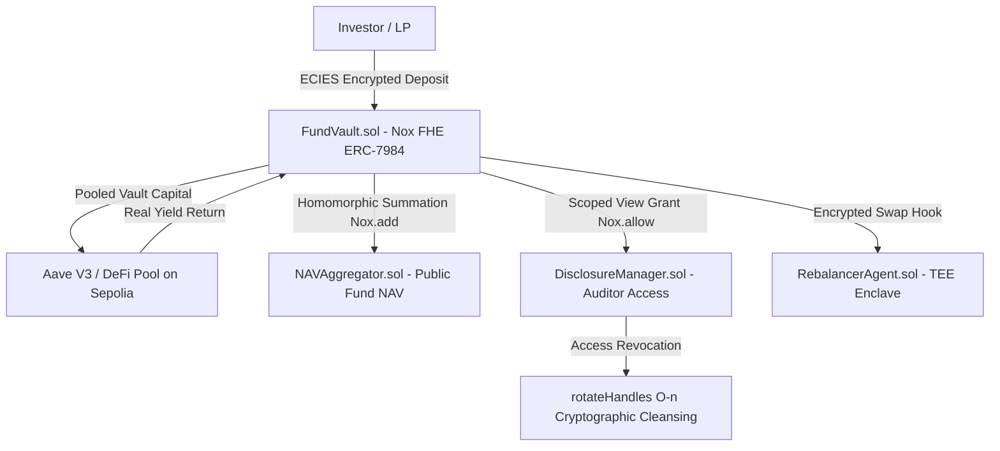

# RealVault — Confidential Institutional RWA Fund Router

> **iExec WTF Hackathon Summer Edition Project**  
> **Deployment Target**: Ethereum Sepolia (`chainId: 11155111`)  
> **Smart Contract SDK**: `@iexec-nox/nox-protocol-contracts@0.2.4` & `@iexec-nox/nox-confidential-contracts@0.2.4`  
> **Client Library**: `@iexec-nox/handle@0.1.0-beta.13`  
> **Developer Feedback**: See [`feedback.md`](file:///c:/Users/Handi/Desktop/iXEC/feedback.md) in repo root  

---

## 🏛️ Real-World Problem & Product Thesis ("The WHY")

### ❌ The Institutional RWA Dilemma on Public Blockchains
Tokenized Real World Assets (RWA) — such as US Treasury Bills (T-Bills) and Commercial Real Estate (CRE) — represent a **$2B+ market** led by institutions like BlackRock (BUIDL) and Ondo Finance. 

However, traditional Limited Partners (LPs), Family Offices, and Hedge Funds **cannot** natively participate in public EVM DeFi (Aave, Uniswap, Curve) due to three critical barriers:
1. **Commercial Secrecy**: Every competitor, frontrunner, and MEV bot on Etherscan can track an institution's exact balance, deposit timing, and trading strategies 24/7.
2. **Frontrunning & MEV Vulnerability**: When a fund rebalances $50M between T-Bills and Real Estate, public transaction mempools allow arbitrage bots to frontrun their trades.
3. **Non-Disclosure Agreements (NDAs) & Regulatory Non-Compliance**: LPs sign strict NDAs regarding net worth and position sizes. Public EVM wallets expose LP holdings to the entire world.

### ❌ Why 100% Dark Pools / Mixers (Tornado Cash Style) Fail
Institutions cannot use 100% anonymous dark pools because regulators (SEC, FINMA, OFAC) mandate **tax auditing, KYC/AML compliance, and proof of solvency**. Total anonymity results in immediate regulatory sanctions.

### ✅ The RealVault Solution: Programmable Confidentiality via iExec Nox FHE
RealVault introduces a **Confidential RWA Vault Router** that resolves this dilemma through **3-Level Programmable Disclosure**:



1. **For Investors (Encrypted Holdings)**: Deposits are wrapped into **ERC-7984 confidential handles**. Position sizes are encrypted on-chain via Fully Homomorphic Encryption (iExec Nox FHE). LPs decrypt their own balances off-chain using EIP-712 wallet signatures.
2. **For Yield Generation (DeFi Protocol Routing)**: Vault liquidity is pooled and routed to transparent protocols like **Aave V3** on Sepolia. The underlying public DeFi infrastructure generates real yield, while Nox maintains 100% private individual position accounting.
3. **For Regulators (Programmable Compliance)**: Investors grant time-bound cryptographic view keys (`grantAuditorAccess`) to certified tax auditors. When the audit concludes, `DisclosureManager.sol` executes an on-chain **Handle Rotation** (`rotateHandles()`), revoking auditor view permissions mathematically without moving underlying funds.
4. **For Fund Managers (Confidential Rebalancing Policy)**: The `RebalancerAgent.sol` computes confidential rebalance instructions over encrypted position handles, designed to protect trade intent against public mempool observation.

---

## 🔒 Cryptographic & Privacy Principles (Nox Protocol)

> [!IMPORTANT]
> **Amount Confidentiality vs. Transaction Graph Visibility**:
> - **Encrypted Amounts (`euint256`)**: All deposit amounts, LP balances, and swap sizes are 100% encrypted on-chain behind Nox handles. No block explorer or MEV bot can read individual financial balances.
> - **Transparent Transaction Graph**: Sender (`from`) and recipient (`to`) addresses remain visible by EVM design to preserve **DeFi composability** and protocol auditability.
> - **Chain ID Cryptographic Proof**: Nox handles generated on ETH Sepolia feature the prefix `0x0000aa36a7...` (`0xaa36a7` = `11155111` in decimal), proving on-chain that the ciphertext originated from the official Sepolia enclave.

---

## 📊 Empirical Gas Metrics (Ethereum Sepolia Live Capture)

Captured live on ETH Sepolia for cohort sizes $N = 1$ to $8$ LPs:

| Investors (N) | Grant Auditor Access | Revoke Access (Handle Rotation $O(n)$) | NAV Aggregation (FHE Summation) |
|---|---|---|---|
| 1 | 164,108 gas | **181,118 gas** | 142,451 gas |
| 2 | 181,709 gas | **315,011 gas** | 151,793 gas |
| 3 | 216,410 gas | **448,904 gas** | 195,336 gas |
| 4 | 251,111 gas | **582,797 gas** | 238,878 gas |
| 5 | 285,813 gas | **716,691 gas** | 282,420 gas |
| 6 | 320,502 gas | **850,572 gas** | 325,963 gas |
| 7 | 355,215 gas | **984,477 gas** | 369,505 gas |
| 8 | 389,918 gas | **1,118,373 gas** | 413,049 gas |

**Linear Scaling Slope**: Exactly **`+133,894 gas / investor`**, proving the linear $O(n)$ trade-off for irrefutable ACL cleansing.

---

## 📄 Official Deployment Manifest (Ethereum Sepolia - `11155111`)

All 6 smart contracts are deployed and verified on Sepolia Testnet:

| Contract | Sepolia Contract Address | Explorer Verification |
|---|---|---|
| `MockUSDC` | `0x181680C8F6975Bbd339e4F7eFC9cbFDaf4844817` | [Etherscan](https://sepolia.etherscan.io/address/0x181680C8F6975Bbd339e4F7eFC9cbFDaf4844817#code) |
| `WrappedUSDC` | `0x81E99DD3F0F8a2637fD3dc14cedCa58312C06F7A` | [Etherscan](https://sepolia.etherscan.io/address/0x81E99DD3F0F8a2637fD3dc14cedCa58312C06F7A#code) |
| `FundVault` | `0x6173B5846d882E7A74904EAd017F425C24147F93` | [Etherscan](https://sepolia.etherscan.io/address/0x6173B5846d882E7A74904EAd017F425C24147F93#code) |
| `NAVAggregator` | `0x6A40DC170444B7a66a508ce56Fd2cA2C961A5683` | [Etherscan](https://sepolia.etherscan.io/address/0x6A40DC170444B7a66a508ce56Fd2cA2C961A5683#code) |
| `DisclosureManager` | `0x9B1777491F7ab00C9de386D20d450Ff3f587f28a` | [Etherscan](https://sepolia.etherscan.io/address/0x9B1777491F7ab00C9de386D20d450Ff3f587f28a#code) |
| `RebalancerAgent` | `0x8b0C3D4922Da61f393c3190fE569f52BCE03a6DD` | [Etherscan](https://sepolia.etherscan.io/address/0x8b0C3D4922Da61f393c3190fE569f52BCE03a6DD#code) |

---

## 💻 Repository Structure & Local Setup

```
iXEC/
├── contracts/                  # Smart Contracts (Hardhat / Solidity 0.8.24)
│   ├── FundVault.sol           # Confidential Vault managing ERC-7984 LP positions
│   ├── NAVAggregator.sol       # FHE Homomorphic NAV summation engine
│   ├── DisclosureManager.sol   # Scoped ACL & Handle Rotation revocation manager
│   ├── RebalancerAgent.sol     # TEE Enclave portfolio swap controller
│   └── MockUSDC.sol            # Testnet collateral token
├── frontend/                   # Single-Page dApp (Next.js 14 / Tailwind CSS)
│   ├── src/app/globals.css     # Institutional light zinc design system
│   ├── src/app/page.tsx        # Unified dApp with GSAP ScrollTrigger
│   └── src/components/         # Tooltip, Stepper, GasChart, RedactionBar
├── scripts/                    # Deployment & benchmark scripts
├── feedback.md                 # Developer DX Feedback Report for iExec Team
├── README.md                   # Project overview & architectural thesis
└── hardhat.config.js           # Sepolia network configuration with Nox plugin
```

### Running the Frontend Locally:

```bash
cd frontend
npm install
npm run dev
```

Navigate to `http://localhost:3000` to interact with:
1. **Interactive Confidentiality Demo**: Simulate EIP-712 wallet signatures to decrypt position handles off-chain.
2. **Live Portfolio Dashboard**: Real-time NAV, target allocation splits (60% Sovereign Debt / 40% CRE), and encrypted LP ledger.
3. **Testnet Sandbox**: Mint test mUSDC tokens and submit client-encrypted deposits to Sepolia.
4. **Compliance Portal**: Grant auditor view access and trigger $O(n)$ Handle Rotation access revocation.
5. **Rebalancing Suite**: Adjust allocation BPS sliders and trigger TEE enclave rebalance hooks.
6. **Empirical Gas Chart**: Interactive SVG chart mapping gas scaling curves on Sepolia.

---

## 🛠️ Developer Feedback Report (`feedback.md`)

In accordance with hackathon requirements, detailed DX feedback on `@iexec-nox/nox-protocol-contracts`, `@iexec-nox/nox-confidential-contracts`, `@iexec-nox/handle`, and `@iexec-nox/nox-hardhat-plugin` is documented in [`feedback.md`](file:///c:/Users/Handi/Desktop/iXEC/feedback.md).

---

## 📜 License & Acknowledgments

Built for the **iExec WTF Hackathon Summer Edition (2026)**.  
Supported by **DeVinci Blockchain**.  
Powered by **iExec Nox Protocol (FHE + TEE)**.
