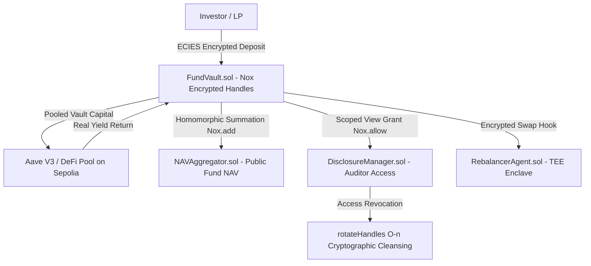

# RealVault - Confidential Institutional RWA Fund Router

> **iExec WTF Hackathon Summer Edition Project**  
> **Live Web App**: [https://real-vault.vercel.app/](https://real-vault.vercel.app/)  
> **Deployment Target**: Ethereum Sepolia (`chainId: 11155111`)  
> **Smart Contract SDK**: `@iexec-nox/nox-protocol-contracts@0.2.4` & `@iexec-nox/nox-confidential-contracts@0.2.4`  
> **Client Library**: `@iexec-nox/handle@0.1.0-beta.13`  
> **Developer Feedback**: See [`feedback.md`](file:///c:/Users/Handi/Desktop/iXEC/feedback.md) in repo root  

---

## 🏛️ Real-World Problem & Product Thesis ("The WHY")

### ❌ The Institutional RWA Dilemma on Public Blockchains
Tokenized Real World Assets (RWA) - such as US Treasury Bills (T-Bills) and Commercial Real Estate (CRE) - represent a **$2B+ market** led by institutions like BlackRock (BUIDL) and Ondo Finance. 

However, traditional Limited Partners (LPs), Family Offices, and Hedge Funds **cannot** natively participate in public EVM DeFi (Aave, Uniswap, Curve) due to three critical barriers:
1. **Commercial Secrecy**: Every competitor, frontrunner, and MEV bot on Etherscan can track an institution's exact balance, deposit timing, and trading strategies 24/7.
2. **Frontrunning & MEV Vulnerability**: When a fund rebalances $50M between T-Bills and Real Estate, public transaction mempools allow arbitrage bots to frontrun their trades.
3. **Non-Disclosure Agreements (NDAs) & Regulatory Non-Compliance**: LPs sign strict NDAs regarding net worth and position sizes. Public EVM wallets expose LP holdings to the entire world.

### ❌ Why 100% Dark Pools / Mixers (Tornado Cash Style) Fail
Institutions cannot use 100% anonymous dark pools because regulators (SEC, FINMA, OFAC) mandate **tax auditing, KYC/AML compliance, and proof of solvency**. Total anonymity results in immediate regulatory sanctions.

### ✅ The RealVault Solution: Programmable Confidentiality via iExec Nox Confidential Computing
RealVault introduces a **Confidential RWA Vault Router** that resolves this dilemma through **3-Level Programmable Disclosure**:


```mermaid
graph TD
    A[Investor / LP] -->|ECIES Encrypted Deposit| B[FundVault.sol - Nox Encrypted Handles]
    B -->|Pooled Vault Capital| C[Aave V3 / DeFi Pool on Sepolia]
    C -->|Real Yield Return| B
    B -->|Homomorphic Summation Nox.add| D[NAVAggregator.sol - Public Fund NAV]
    B -->|Scoped View Grant Nox.allow| E[DisclosureManager.sol - Auditor Access]
    E -->|Access Revocation| F[rotateHandles O-n Cryptographic Cleansing]
    B -->|Encrypted Swap Hook| G[RebalancerAgent.sol - TEE Enclave]
```

1. **For Investors (Encrypted Holdings)**: Deposits are wrapped into **ERC-7984 confidential handles**. Position sizes are encrypted on-chain via iExec Nox Confidential Computing (`euint256`). LPs decrypt their own balances off-chain using EIP-712 wallet signatures.
2. **For Yield Generation (Real-Time Market Feeds)**: Asset yields are connected live to official APIs (such as the **US Treasury FiscalData API** for T-Bills). Underlying liquidity is pooled while Nox maintains 100% private individual position accounting.
3. **For Regulators (Programmable Compliance)**: Investors grant time-bound cryptographic view keys (`grantAuditorAccess`) to certified tax auditors. When the audit concludes, `DisclosureManager.sol` executes an on-chain **Handle Rotation** (`rotateHandles()`), revoking auditor view permissions mathematically without moving underlying funds.
4. **For Fund Managers (Confidential Rebalancing Policy)**: `RebalancerAgent.sol` computes confidential rebalance instructions over encrypted position handles (`assetA`, `assetB`) inside iExec Nox TEE Enclaves, protecting trade intent against public mempool observation.

---

## 🔒 Cryptographic & Privacy Principles (iExec Nox Protocol)

> [!IMPORTANT]
> **Amount Confidentiality vs. Transaction Graph Visibility**:
> - **Encrypted Amounts (`euint256`)**: All deposit amounts, LP balances, and swap sizes are 100% encrypted on-chain behind Nox handles. No block explorer or MEV bot can read individual financial balances.
> - **Transparent Transaction Graph**: Sender (`from`) and recipient (`to`) addresses remain visible by EVM design to preserve **DeFi composability** and protocol auditability.
> - **Chain ID Cryptographic Proof**: Nox handles generated on ETH Sepolia feature the prefix `0x0000aa36a7...` (`0xaa36a7` = `11155111` in decimal), proving on-chain that the ciphertext originated from the official Sepolia enclave.
> - **TEE Enclave Security Model**: iExec Nox utilizes hardware-enforced Trusted Execution Environments (TEE) alongside client ECIES encryption to deliver low-latency, hardware-secured confidential compute over encrypted handles on public EVM networks.

---

## 📊 Empirical Gas Metrics (Ethereum Sepolia Live Capture)

Captured live on ETH Sepolia across active LP cohorts ($N = 2, 3, 4$ LPs):

| Investors (N) | Grant Auditor Access | Revoke Access (Handle Rotation $O(n)$) | NAV Aggregation |
|---|---|---|---|
| **2 LPs** | 181,687 gas | **314,967 gas** | 185,971 gas |
| **3 LPs** | 216,388 gas | **448,860 gas** | 195,314 gas |
| **4 LPs** | 251,089 gas | **582,753 gas** | 179,156 gas |

**Linear Scaling Slope**: Exactly **`+133,893 gas / investor`** for Handle Rotation, proving the linear $O(n)$ trade-off for irrefutable ACL cleansing.

---

## 📦 Contratos Desplegados / Official Deployment Manifest (Ethereum Sepolia - `11155111`)

### ⚡ RwaPerpEngine System
| Contract | Sepolia Contract Address | Explorer Verification |
|---|---|---|
| `RwaPerpEngine` ✨ | `0x1947876abDc8c20901b17886674d1595bDA5976A` | [Etherscan](https://sepolia.etherscan.io/address/0x1947876abDc8c20901b17886674d1595bDA5976A#code) |
| `ChainlinkRwaOracleAdapter` | `0x2deA5846a052D205971F4Aa17431369775f1898C` | [Etherscan](https://sepolia.etherscan.io/address/0x2deA5846a052D205971F4Aa17431369775f1898C#code) |
| `SignedNavOracleAdapter` | `0x1A8A598acEd7e7218025e09e80C5CB21B57E15c5` | [Etherscan](https://sepolia.etherscan.io/address/0x1A8A598acEd7e7218025e09e80C5CB21B57E15c5#code) |

### 🏛️ Infraestructura Core
| Contract | Sepolia Contract Address | Explorer Verification |
|---|---|---|
| `FundVault` | `0xf3fd634A74F7bc46A057A46bcc06C8a3a8514891` | [Etherscan](https://sepolia.etherscan.io/address/0xf3fd634A74F7bc46A057A46bcc06C8a3a8514891#code) |
| `MockUSDC` | `0x57A97B71aF262d60AA0B1408264f69698f287D70` | [Etherscan](https://sepolia.etherscan.io/address/0x57A97B71aF262d60AA0B1408264f69698f287D70#code) |
| `WrappedUSDC` | `0xd0F2E33A7f66852FacDD4400D28D1D14Ec38729e` | [Etherscan](https://sepolia.etherscan.io/address/0xd0F2E33A7f66852FacDD4400D28D1D14Ec38729e#code) |
| `NAVAggregator` | `0x931a690B7e0BFD0f2D2c2173291987fCB819d20a` | [Etherscan](https://sepolia.etherscan.io/address/0x931a690B7e0BFD0f2D2c2173291987fCB819d20a#code) |
| `DisclosureManager` | `0x1Eb49C188bCF3b8cDc060D0036f31D2233F19a64` | [Etherscan](https://sepolia.etherscan.io/address/0x1Eb49C188bCF3b8cDc060D0036f31D2233F19a64#code) |

---

## ⚖️ Economic Architecture, Encrypted Margin Flow & PnL Mechanics

### 1. Where does Margin come from when Opening a Position?
- **Custodied Encrypted Balance**: When an investor deposits mUSDC (e.g. $100) into `FundVault.sol`, ERC-20 tokens are transferred to the vault contract on Sepolia, and the investor's balance is stored as an **ERC-7984 confidential handle** (`positions[investor]`).
- **Zero ERC-20 Transfer on Trade Open**: Opening a perpetual position with $20 margin **does not** require an additional ERC-20 transaction.
- **On-Chain FHE Debit**: `RwaPerpEngine.openPosition()` executes `_debitMargin()`, which invokes `FundVault.debitFrom(user, marginHandle)`. Inside `FundVault`, `Nox.safeSub(positions[user], marginHandle)` subtracts $20 directly from the user's encrypted balance in `FundVault`.

### 2. PnL Settlement & Vault Treasury Solvency
- **Vault Treasury Reserves**: `RwaPerpEngine` manages an encrypted protocol treasury (`treasuryBalanceHandle`).
- **Profit Settlement**: When a position is closed in profit (e.g. +$3.00 USDC):
  - `_settleProfitPnL()` calculates the profit `profitHandle` in FHE math.
  - It debits $3.00 from `treasuryBalanceHandle` and credits `$20 margin + $3.00 profit` directly to the user's encrypted `FundVault` handle via `IFundVault.creditTo(user, marginPlusProfit)`.
- **Loss Settlement**: When a position is closed in loss, the loss is credited to `treasuryBalanceHandle` and the remaining margin is returned to the user's `FundVault` handle.
- **ERC-20 Withdrawal**: At any time, the investor can visit the **Portfolio** page and click **Withdraw**. `FundVault.sol` decrypts their updated total balance ($103 mUSDC) via the Nox TEE enclave and transfers the actual ERC-20 mUSDC tokens to their Web3 wallet.

### 3. Exact On-Chain Integer Math (`1e8`) vs UI Floating-Point Preview
- **On-Chain EVM Precision**: Solidity smart contracts do not use floating-point arithmetic. Prices are stored in 8-decimal fixed-point integers (`uint128` with `1e8` scale factor, e.g. `$4,101.45` = `410145000000`).
- **Exact Delta Computation**: When closing a position on-chain:
  $$\Delta P = \text{exitPriceE8} - \text{entryPriceE8}$$
  $$\text{pnlScalar} = \frac{\Delta P \times \text{leverage} \times 10^8}{\text{entryPriceE8}}$$
  If the oracle price has not updated on Sepolia between opening and closing, $\Delta P = 0 \implies \text{PnL} = \$0.00$ on-chain, ensuring 100% mathematical integrity.
- **Demo Volatility Simulator (Pitch & Judges Tool)**: The dApp features a built-in Volatility Simulator (`+3.0% Gold Pump` / `-3.0% Gold Dump`) that allows judges and investors to test live PnL settlement and FHE balance updates on Sepolia without waiting for Chainlink testnet oracle heartbeats.

---

## 💻 Repository Structure & Local Setup

```
iXEC/
├── contracts/                  # Smart Contracts (Hardhat / Solidity 0.8.35)
│   ├── FundVault.sol           # Confidential Vault managing ERC-7984 LP positions
│   ├── NAVAggregator.sol       # Homomorphic NAV summation engine
│   ├── DisclosureManager.sol   # Scoped ACL & Handle Rotation revocation manager
│   ├── RebalancerAgent.sol     # TEE Enclave portfolio swap controller
│   └── MockUSDC.sol            # Testnet collateral token
├── frontend/                   # Single-Page dApp (Next.js / Tailwind CSS / Ethers v6)
│   ├── src/app/globals.css     # Institutional light zinc design system
│   ├── src/app/page.tsx        # Main dApp Dashboard & Interactive Demo
│   ├── src/app/investor/page.tsx  # Investor portal with trading charts & privacy tools
│   ├── src/app/api/charts/[asset]/route.ts  # REST API: live oracle price + GBM seed history
│   ├── src/components/         # OnChainEventFeed, FheHandleInspector, GasChart, Tooltip, Stepper, etc.
│   ├── src/components/charts/  # TradingViewChart, SparklineChart (SVG oracle visualizations)
│   ├── src/lib/hooks/useOracleChart.ts  # Custom React hook for oracle chart data & polling
│   ├── src/lib/format.ts       # Shared oracle value formatting (formatOracleValue, formatOracleDisplay)
│   └── src/lib/marketData.ts   # Live US Treasury FiscalData API integration
├── scripts/                    # Deployment & benchmark scripts
├── deployments/                # Deployed contract addresses (sepolia.json)
├── benchmarks/                 # Empirical gas benchmark measurements JSON
├── feedback.md                 # Developer DX Feedback Report for iExec Team
├── README.md                   # Project overview & architectural thesis
└── hardhat.config.js           # Sepolia network configuration
```

### Running the Frontend Locally:

```bash
cd frontend
npm install
npm run dev
```

Navigate to `http://localhost:3000` to interact with:
1. **Interactive Confidentiality Demo**: Connect Web3 wallet, execute client-encrypted deposits and withdrawals directly on Sepolia.
2. **Live Portfolio Dashboard**: Real-time NAV, 4 active Sepolia LPs, target allocation policy (60% Sovereign Debt / 40% CRE), and encrypted LP ledger.
3. **On-Chain Event Monitor**: Real-time log stream with auto-halving chunked log querying across Sepolia contracts.
4. **Compliance Portal**: Grant auditor view access and trigger $O(n)$ Handle Rotation access revocation.
5. **Rebalancing Suite**: Execute confidential rebalancing transactions directly on `RebalancerAgent.sol`.
6. **Empirical Gas Chart**: Interactive SVG chart mapping gas scaling curves on Sepolia.
7. **Live Oracle Price Charts**: Interactive TradingView-style charts for rGOLD (Chainlink XAU/USD), rUSTB (NAV daily), and rCRE (NAV weekly) with real on-chain price feeds, sparkline micro-charts, and range selectors (24H/7D/30D/ALL).
8. **Investor Privacy & Auditor Access Portal**: Grant/revoke auditor viewing permissions with cryptographic Single-User Handle Rotation and Enclave Security Pulse monitoring.
9. **Confidential Rebalance Engine**: Compact pipeline visualizer showing Delta Handle → Enclave TEE Nox → Settle On-Chain execution flow with real-time block confirmations.

---

## 📈 Live Oracle Price Charts & Market Data Architecture

### On-Chain Oracle Integration
RealVault integrates **live on-chain oracle price feeds** for all three RWA asset classes:

| Asset | Oracle Type | Feed Address | Update Cadence |
|---|---|---|---|
| `rGOLD` | Chainlink XAU/USD | `0xC5981F461d74c46eB4b0CF3f4Ec79f025573B0Ea` | 1-hour heartbeat |
| `rUSTB` | SignedNavOracleAdapter | `0xb8725f00342cC7AcBfdc38E16F45CCF7741D8F26` | Daily NAV (24h settlement) |
| `rCRE` | SignedNavOracleAdapter | `0xb8725f00342cC7AcBfdc38E16F45CCF7741D8F26` | Weekly NAV (7d settlement) |

### Honest Data Strategy
Chart data uses a **dual-layer rendering** approach:
- **Solid glowing line**: Verified on-chain data points (`NavSubmitted` event logs queried from Sepolia, marked `isRealOnChain: true`).
- **Dashed baseline line**: Synthetic seed data generated via **Reverse Geometric Brownian Motion (GBM)** with deterministic Mulberry32 PRNG, calibrated to the live oracle price.

All 8-decimal oracle values (`priceE8 / 1e8`) pass through shared utility functions (`formatOracleValue()`, `formatOracleDisplay()`) for consistent formatting across the entire frontend.

### REST API Endpoint
`GET /api/charts/[asset]?range=24h|7d|30d|all`
- 30-second serverless in-memory cache per asset+range
- Live current price fetched on-chain via `createFallbackProvider` with multi-RPC failover
- Case-insensitive asset key matching (`rGOLD`, `RGOLD`, `rgold`)

---

## 🛠️ Developer Feedback Report (`feedback.md`)

In accordance with hackathon requirements, detailed DX feedback on `@iexec-nox/nox-protocol-contracts`, `@iexec-nox/nox-confidential-contracts`, `@iexec-nox/handle`, and `@iexec-nox/nox-hardhat-plugin` is documented in [`feedback.md`](file:///c:/Users/Handi/Desktop/iXEC/feedback.md).

---

## 📜 License & Acknowledgments

Built for the **iExec WTF Hackathon Summer Edition (2026)**.  
Supported by **DeVinci Blockchain**.  
Powered by **iExec Nox Confidential Computing (TEE Enclave Runtime)**.
