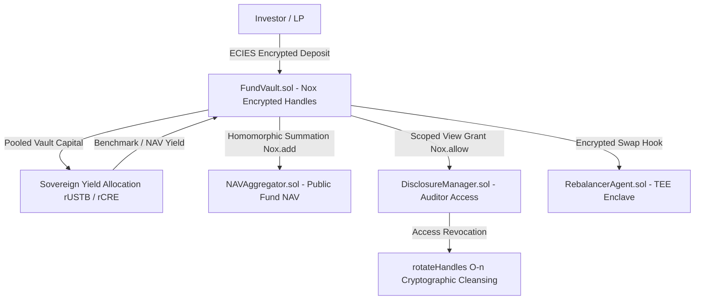
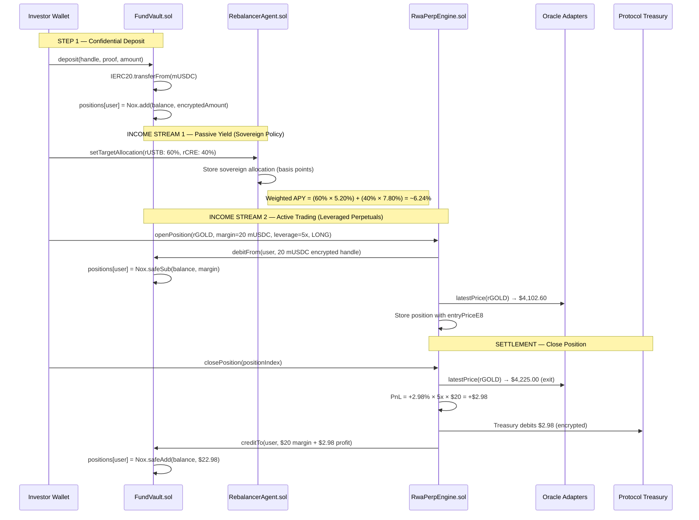

# RealVault - Confidential Institutional RWA Fund Router

> **iExec WTF Hackathon Summer Edition Project**  
> **Live Web App**: [https://real-vault.vercel.app/](https://real-vault.vercel.app/)  
> **Deployment Target**: Ethereum Sepolia (`chainId: 11155111`)  
> **Smart Contract SDK**: `@iexec-nox/nox-protocol-contracts@0.2.4` & `@iexec-nox/nox-confidential-contracts@0.2.4`  
> **Client Library**: `@iexec-nox/handle@0.1.0-beta.13`  
> **Developer Feedback**: See [`feedback.md`](./feedback.md) in repo root  

---

## 🏛️ Real-World Problem & Product Thesis ("The WHY")

### ❌ The Institutional RWA Dilemma on Public Blockchains
Tokenized Real World Assets (RWA) - such as US Treasury Bills (T-Bills) and Commercial Real Estate (CRE) - represent a **$2B+ market** led by institutions like BlackRock (BUIDL) and Ondo Finance. 

However, traditional Limited Partners (LPs), Family Offices, and Hedge Funds **cannot** natively participate in public EVM DeFi (Aave, Uniswap, Curve) due to three critical barriers:
1. **Commercial Secrecy**: Every competitor, frontrunner, and MEV bot on Etherscan can track an institution's exact balance, deposit timing, and trading strategies 24/7.
2. **Frontrunning & MEV Vulnerability**: When a fund rebalances $50M between T-Bills and Real Estate, public transaction mempools allow arbitrage bots to frontrun their trades.
3. **Non-Disclosure Agreements (NDAs) & Regulatory Non-Compliance**: LPs sign strict NDAs regarding net worth and position sizes. Public EVM wallets expose LP holdings to the entire world.

### ❌ Why 100% Dark Pools / Mixers (Tornado Cash Style) Fail
Institutions cannot use 100% anonymous dark pools because regulators (SEC, FINMA, OFAC) mandate **tax auditing, KYC/AML compliance, and proof of solvency**. Total anonymity results in immediate regulatory sanctions.

### ✅ The RealVault Solution: Programmable Confidentiality via iExec Nox Confidential Computing
RealVault introduces a **Confidential RWA Vault Router** that resolves this dilemma through **3-Level Programmable Disclosure**:


```mermaid
graph TD
    A[Investor / LP] -->|ECIES Encrypted Deposit| B[FundVault.sol - Nox Encrypted Handles]
    B -->|Pooled Vault Capital| C[Sovereign Yield Allocation rUSTB / rCRE]
    C -->|Benchmark / NAV Yield| B
    B -->|Homomorphic Summation Nox.add| D[NAVAggregator.sol - Public Fund NAV]
    B -->|Scoped View Grant Nox.allow| E[DisclosureManager.sol - Auditor Access]
    E -->|Access Revocation| F[rotateHandles O-n Cryptographic Cleansing]
    B -->|Encrypted Swap Hook| G[RebalancerAgent.sol - TEE Enclave]
```

1. **For Investors (Encrypted Holdings)**: Deposits are wrapped into **ERC-7984 confidential handles**. Position sizes are encrypted on-chain via iExec Nox Confidential Computing (`euint256`). LPs decrypt their own balances off-chain using EIP-712 wallet signatures.
2. **For Yield Generation (Real-Time Market Feeds)**: Asset yields are connected live to official APIs (such as the **US Treasury FiscalData API** for T-Bills). Underlying liquidity is pooled while Nox maintains 100% private individual position accounting.
3. **For Regulators (Programmable Compliance)**: Investors grant time-bound cryptographic view keys (`grantAuditorAccess`) to certified tax auditors. When the audit concludes, `DisclosureManager.sol` executes an on-chain **Handle Rotation** (`rotateHandles()`), revoking auditor view permissions mathematically without moving underlying funds.
4. **For Fund Managers (Confidential Rebalancing Policy)**: `RebalancerAgent.sol` computes confidential rebalance instructions over encrypted position handles (`assetA`, `assetB`) inside iExec Nox TEE Enclaves, protecting trade intent against public mempool observation.

---

## 🔒 Cryptographic & Privacy Principles (iExec Nox Protocol)

> [!IMPORTANT]
> **Amount Confidentiality vs. Transaction Graph Visibility**:
> - **Encrypted Amounts (`euint256`)**: All deposit amounts, LP balances, and swap sizes are 100% encrypted on-chain behind Nox handles. No block explorer or MEV bot can read individual financial balances.
> - **Transparent Transaction Graph**: Sender (`from`) and recipient (`to`) addresses remain visible by EVM design to preserve **DeFi composability** and protocol auditability.
> - **Chain ID Cryptographic Proof**: Nox handles generated on ETH Sepolia feature the prefix `0x0000aa36a7...` (`0xaa36a7` = `11155111` in decimal), proving on-chain that the ciphertext originated from the official Sepolia enclave.
> - **TEE Enclave Security Model**: iExec Nox utilizes hardware-enforced Trusted Execution Environments (TEE) alongside client ECIES encryption to deliver low-latency, hardware-secured confidential compute over encrypted handles on public EVM networks.

---

## 📊 Empirical Gas Metrics (Ethereum Sepolia Live Capture)

Captured live on ETH Sepolia across active LP cohorts ($N = 2, 3, 4$ LPs):

| Investors (N) | Grant Auditor Access | Revoke Access (Handle Rotation $O(n)$) | NAV Aggregation |
|---|---|---|---|
| **2 LPs** | 181,687 gas | **314,967 gas** | 185,971 gas |
| **3 LPs** | 216,388 gas | **448,860 gas** | 195,314 gas |
| **4 LPs** | 251,089 gas | **582,753 gas** | 179,156 gas |

**Linear Scaling Slope**: Exactly **`+133,893 gas / investor`** for Handle Rotation, proving the linear $O(n)$ trade-off for irrefutable ACL cleansing.

---

## 📦 Contratos Desplegados / Official Deployment Manifest (Ethereum Sepolia - `11155111`)

### ⚡ RwaPerpEngine System
| Contract | Sepolia Contract Address | Explorer Verification |
|---|---|---|
| `RwaPerpEngine` ✨ | `0x1947876abDc8c20901b17886674d1595bDA5976A` | [Etherscan](https://sepolia.etherscan.io/address/0x1947876abDc8c20901b17886674d1595bDA5976A#code) |
| `ChainlinkRwaOracleAdapter` | `0x2deA5846a052D205971F4Aa17431369775f1898C` | [Etherscan](https://sepolia.etherscan.io/address/0x2deA5846a052D205971F4Aa17431369775f1898C#code) |
| `SignedNavOracleAdapter` | `0x1A8A598acEd7e7218025e09e80C5CB21B57E15c5` | [Etherscan](https://sepolia.etherscan.io/address/0x1A8A598acEd7e7218025e09e80C5CB21B57E15c5#code) |

### 🏛️ Infraestructura Core
| Contract | Sepolia Contract Address | Explorer Verification |
|---|---|---|
| `FundVault` | `0xf3fd634A74F7bc46A057A46bcc06C8a3a8514891` | [Etherscan](https://sepolia.etherscan.io/address/0xf3fd634A74F7bc46A057A46bcc06C8a3a8514891#code) |
| `MockUSDC` | `0x57A97B71aF262d60AA0B1408264f69698f287D70` | [Etherscan](https://sepolia.etherscan.io/address/0x57A97B71aF262d60AA0B1408264f69698f287D70#code) |
| `WrappedUSDC` | `0xd0F2E33A7f66852FacDD4400D28D1D14Ec38729e` | [Etherscan](https://sepolia.etherscan.io/address/0xd0F2E33A7f66852FacDD4400D28D1D14Ec38729e#code) |
| `NAVAggregator` | `0x931a690B7e0BFD0f2D2c2173291987fCB819d20a` | [Etherscan](https://sepolia.etherscan.io/address/0x931a690B7e0BFD0f2D2c2173291987fCB819d20a#code) |
| `DisclosureManager` | `0x1Eb49C188bCF3b8cDc060D0036f31D2233F19a64` | [Etherscan](https://sepolia.etherscan.io/address/0x1Eb49C188bCF3b8cDc060D0036f31D2233F19a64#code) |

---

## ⚖️ Economic Architecture: Dual-Income Engine (Yield + Trading)

> [!NOTE]
> RealVault's core innovation is a **Dual-Income Architecture** where a single encrypted vault balance simultaneously generates **passive yield** via sovereign allocation policy AND serves as **active trading collateral** for leveraged perpetual positions — all without ever revealing the investor's balance.

### The Dual-Income Flow (How a Single Deposit Works Twice)


```mermaid
sequenceDiagram
    participant I as Investor Wallet
    participant V as FundVault.sol
    participant R as RebalancerAgent.sol
    participant E as RwaPerpEngine.sol
    participant O as Oracle Adapters
    participant T as Protocol Treasury

    Note over I,V: STEP 1 — Confidential Deposit
    I->>V: deposit(handle, proof, amount)
    V->>V: IERC20.transferFrom(mUSDC)
    V->>V: positions[user] = Nox.add(balance, encryptedAmount)

    Note over V,R: INCOME STREAM 1 — Passive Yield (Sovereign Policy)
    I->>R: setTargetAllocation(rUSTB: 60%, rCRE: 40%)
    R->>R: Store sovereign allocation (basis points)
    Note right of R: Weighted APY = (60% × 5.20%) + (40% × 7.80%) = ~6.24%

    Note over V,E: INCOME STREAM 2 — Active Trading (Leveraged Perpetuals)
    I->>E: openPosition(rGOLD, margin=20 mUSDC, leverage=5x, LONG)
    E->>V: debitFrom(user, 20 mUSDC encrypted handle)
    V->>V: positions[user] = Nox.safeSub(balance, margin)
    E->>O: latestPrice(rGOLD) → $4,102.60
    E->>E: Store position with entryPriceE8

    Note over E,T: SETTLEMENT — Close Position
    I->>E: closePosition(positionIndex)
    E->>O: latestPrice(rGOLD) → $4,225.00 (exit)
    E->>E: PnL = +2.98% × 5x × $20 = +$2.98
    E->>T: Treasury debits $2.98 (encrypted)
    E->>V: creditTo(user, $20 margin + $2.98 profit)
    V->>V: positions[user] = Nox.safeAdd(balance, $22.98)
```

---

## 💰 Encrypted Margin Flow & PnL Mechanics

### 1. Where Does Margin Come From?

When an investor deposits mUSDC (e.g. $100) into `FundVault.sol`, the ERC-20 tokens are transferred to the vault contract on Sepolia, and the investor's balance is stored as an **ERC-7984 confidential handle** (`positions[investor]`).

**Critical Design**: Opening a perpetual position with $20 margin **does not** require any additional ERC-20 transfer. The margin is debited entirely from the user's **existing encrypted vault balance**:

```
FundVault Balance: ████████ (encrypted, e.g. 100 mUSDC)
         │
         ▼ RwaPerpEngine.openPosition()
         │
         ├── _debitMargin(user, 20 mUSDC handle)
         │     └── FundVault.debitFrom(user, marginHandle)
         │           └── Nox.safeSub(positions[user], marginHandle)
         │
         ├── FundVault Balance: ████████ (now 80 mUSDC, encrypted)
         └── Position Margin:   ████████ (20 mUSDC locked, encrypted)
```

> [!IMPORTANT]
> **Zero ERC-20 Transfer on Trade Open**: `RwaPerpEngine.openPosition()` executes `_debitMargin()`, which invokes `FundVault.debitFrom(user, marginHandle)`. Inside `FundVault`, `Nox.safeSub(positions[user], marginHandle)` subtracts the margin directly from the user's encrypted balance. No tokens leave the vault — only the encrypted accounting ledger changes.

### 2. PnL Settlement & Vault Treasury Solvency

`RwaPerpEngine` manages an encrypted protocol treasury (`treasuryBalanceHandle`) that acts as the counterparty for all positions:

| Scenario | Settlement Flow | User Receives | Treasury Effect |
|---|---|---|---|
| **Profit** (+$3.00) | `_settleProfitPnL()` | Margin ($20) + Profit ($3) = **$23 mUSDC** | Treasury debits $3 |
| **Loss** (-$5.00) | `_settleLossPnL()` | Margin ($20) - Loss ($5) = **$15 mUSDC** | Treasury credits $5 |
| **Zero PnL** ($0.00) | Direct return | Full margin ($20) = **$20 mUSDC** | No change |
| **Total Loss** (-100%) | Loss capped to margin | **$0 mUSDC** | Treasury credits $20 |

**Key Safety Mechanisms**:
- **Loss Capping**: `Nox.select(lossExceedsMargin, marginHandle, lossHandle)` — losses can never exceed the deposited margin
- **Treasury Solvency Check**: `Nox.select(treasuryCovers, profitHandle, treasuryBalance)` — profits are capped to available treasury reserves
- **All arithmetic uses `Nox.safeAdd` / `Nox.safeSub`** with `ebool` validation to prevent underflow/overflow
- **ERC-20 Withdrawal**: At any time, the investor can withdraw. `FundVault.sol` decrypts their total balance via the Nox TEE enclave and transfers actual ERC-20 mUSDC tokens to their Web3 wallet

### 3. Exact On-Chain Integer Math (`1e8`) vs UI Floating-Point Preview

**On-Chain EVM Precision**: Solidity smart contracts do not use floating-point arithmetic. Prices are stored in 8-decimal fixed-point integers (`uint128` with `1e8` scale factor, e.g. `$4,101.45` = `410145000000`).

**Exact Delta Computation**: When closing a position on-chain:
$$\Delta P = \text{exitPriceE8} - \text{entryPriceE8}$$
$$\text{pnlScalar} = \frac{\Delta P \times \text{leverage} \times 10^8}{\text{entryPriceE8}}$$

If the oracle price has not updated on Sepolia between opening and closing, $\Delta P = 0 \implies \text{PnL} = \$0.00$ on-chain, ensuring 100% mathematical integrity.

**Demo Volatility Simulator (Pitch & Judges Tool)**: The dApp features a built-in Volatility Simulator (`+3.0% Gold Pump` / `-3.0% Gold Dump`) that allows judges and investors to test live PnL settlement and FHE balance updates on Sepolia without waiting for Chainlink testnet oracle heartbeats.

---

## 📈 Sovereign Yield Policy & APY Calculation Engine

### How APY is Calculated (Market Benchmark Simulation & On-Chain Verification)

RealVault's **Automated Yield Strategy Widget** computes projected APY through a transparent, auditable methodology:

#### Step 1: Asset-Class Market Benchmarks (Fallback Rates)

When on-chain historical NAV data spans less than 24 hours (insufficient for annualization), the system uses **documented market benchmarks** as conservative fallback rates:

| Asset Class | Benchmark APY | Source | Oracle Contract |
|---|---|---|---|
| **rUSTB** (US Treasury Bills) | ~5.20% | US Treasury FiscalData API | `SignedNavOracleAdapter` (`0x1A8A59...`) |
| **rCRE** (Commercial Real Estate) | ~7.80% | Institutional CRE Index | `SignedNavOracleAdapter` (`0x1A8A59...`) |

#### Step 2: On-Chain Annualized APY (When Available)

When `SignedNavOracleAdapter.sol` has at least 24 hours of `NavSubmitted` event history on Sepolia, the system calculates a **real annualized APY** directly from on-chain data:

```
APY = ( NAV_latest / NAV_earliest ) ^ ( 365 / timeSpanDays ) - 1
```

- Clamped between **-50% and +200%** for economic sanity
- Requires ≥ 1.0 full day of on-chain NAV history
- Source: `SignedNavOracleAdapter.sol` event logs queried via Sepolia RPC

#### Step 3: Weighted Target APY (Sovereign Policy Derived)

The investor's **sovereign allocation policy** (stored on-chain in `RebalancerAgent.sol`) determines the weighted target APY:

```
Weighted APY = (rUSTB_Weight × rUSTB_APY) + (rCRE_Weight × rCRE_APY)
```

#### Policy Allocation Presets

| Preset | rUSTB (T-Bills) | rCRE (Real Estate) | Weighted Target APY |
|---|---|---|---|
| **Conservative T-Bills** | 80% | 20% | ~5.72% |
| **Balanced Strategy** | 50% | 50% | ~6.50% |
| **High-Yield CRE** | 30% | 70% | ~7.02% |

### Save Sovereign Policy On-Chain

When an investor clicks **"Save Sovereign Policy On-Chain"**, the dApp executes a live Sepolia transaction to `RebalancerAgent.setTargetAllocation(targetA, targetB)`:

```solidity
// RebalancerAgent.sol — Sovereign allocation policy storage
function setTargetAllocation(uint256 _targetA, uint256 _targetB) external {
    require(_targetA + _targetB == 10000, "Allocation must sum to 100%");
    userTargetAllocA[msg.sender] = _targetA;  // e.g. 6000 = 60% rUSTB
    userTargetAllocB[msg.sender] = _targetB;  // e.g. 4000 = 40% rCRE
    emit TargetAllocationUpdated(msg.sender, _targetA, _targetB);
}
```

This registers the investor's **sovereign preference** on-chain. The allocation policy determines how the vault's idle capital is distributed between Sovereign Debt (rUSTB) and Commercial Real Estate (rCRE) yield strategies, while remaining capital is simultaneously available for active margin trading.

---

## 🔄 Dual-Income Coexistence: Yield + Trading Simultaneously

> [!TIP]
> **The key insight**: An investor's `FundVault` balance is a single encrypted pool that serves **two purposes at once**:
> 1. **Idle capital** generates passive APY through the sovereign allocation policy (`RebalancerAgent.sol`)
> 2. **Active margin** is locked in leveraged perpetual positions (`RwaPerpEngine.sol`)
>
> Both income streams coexist. When a position is closed, margin + PnL returns to the vault balance, immediately rejoining the yield pool.

### Complete Capital Lifecycle Example

```
Investor deposits $100 mUSDC into FundVault
    │
    ├── $80 remains as "free balance" (idle capital)
    │     └── Generating ~6.50% APY via Sovereign Policy (50/50 rUSTB/rCRE)
    │           ├── $40 allocated to rUSTB → 5.20% benchmark
    │           └── $40 allocated to rCRE  → 7.80% benchmark
    │
    └── $20 locked as margin in RwaPerpEngine
          └── rGOLD LONG 5x Leverage
                ├── Entry: $4,102.60 (Chainlink XAU/USD)
                ├── Exit:  $4,225.00 (+2.98%)
                └── PnL:   +$2.98 (2.98% × 5x × $20)

Position closes → $22.98 returns to FundVault
    │
    └── New free balance: $102.98 (all generating yield)
```

### Portfolio View: Total Net Equity

The dApp's **Shadow Wallet** (Portfolio) and **Home** page display a complete breakdown:

| Component | Value | Visibility |
|---|---|---|
| **Vault Position Balance (Free)** | ████████ (encrypted) | Revealed after EIP-712 wallet authorization |
| **Active Locked Margin (Perp Engine)** | ████████ (encrypted) | Revealed after EIP-712 wallet authorization |
| **Total Net Equity** | Free Balance + Active Margin | Computed client-side after decryption |
| **Unrealized PnL** | (Net Equity - Gross Collateral) | Live from oracle price delta |

> [!CAUTION]
> All financial values (vault balance, active margin, total equity) remain **fully redacted** behind `RedactionBar` components until the investor explicitly authorizes decryption via EIP-712 wallet signature. This prevents accidental information disclosure on shared screens or screenshots.

---

## 📈 Live Oracle Price Charts & Market Data Architecture

### On-Chain Oracle Integration
RealVault integrates **live on-chain oracle price feeds** for all three RWA asset classes:

| Asset | Oracle Type | Feed Address | Update Cadence |
|---|---|---|---|
| `rGOLD` | Chainlink XAU/USD | `0xC5981F461d74c46eB4b0CF3f4Ec79f025573B0Ea` | 1-hour heartbeat |
| `rUSTB` | SignedNavOracleAdapter | `0x1A8A598acEd7e7218025e09e80C5CB21B57E15c5` | Daily NAV (24h settlement) |
| `rCRE` | SignedNavOracleAdapter | `0x1A8A598acEd7e7218025e09e80C5CB21B57E15c5` | Weekly NAV (7d settlement) |

### Oracle Adapter Architecture

Each asset class uses a specific oracle adapter implementing the `IRwaPriceOracle` interface:

- **`ChainlinkRwaOracleAdapter`** (`0x2deA58...`): Wraps Chainlink's `AggregatorV3Interface` for rGOLD (XAU/USD). Reads `latestRoundData()` directly on-chain with staleness validation.
- **`SignedNavOracleAdapter`** (`0x1A8A59...`): Custom adapter for rUSTB and rCRE. Accepts signed NAV updates from authorized publishers (US Treasury FiscalData API for T-Bills, institutional CRE index for Real Estate). Each update emits a `NavSubmitted` event on Sepolia with the 8-decimal price and publisher signature.

### Honest Data Strategy
Chart data uses a **dual-layer rendering** approach:
- **Solid glowing line**: Verified on-chain data points (`NavSubmitted` event logs queried from Sepolia, marked `isRealOnChain: true`).
- **Dashed baseline line**: Historical baseline seeded using **deterministic linear trend interpolation** anchored strictly to the live on-chain oracle price (zero stochastic noise or synthetic price generation).

All 8-decimal oracle values (`priceE8 / 1e8`) pass through shared utility functions (`formatOracleValue()`, `formatOracleDisplay()`) for consistent formatting across the entire frontend.

### REST API Endpoint
`GET /api/charts/[asset]?range=24h|7d|30d|all`
- 30-second serverless in-memory cache per asset+range
- Live current price fetched on-chain via `createFallbackProvider` with multi-RPC failover
- Case-insensitive asset key matching (`rGOLD`, `RGOLD`, `rgold`)

---

## 💻 Repository Structure & Local Setup

```
iXEC/
├── contracts/                          # Smart Contracts (Hardhat / Solidity 0.8.35)
│   ├── FundVault.sol                   # Confidential Vault — ERC-7984 encrypted LP positions
│   ├── RwaPerpEngine.sol               # Leveraged perpetual engine — encrypted margin & PnL
│   ├── RwaPerpMath.sol                 # Pure PnL calculation library (1e8 fixed-point)
│   ├── RwaPerpTypes.sol                # Position & AssetConfig struct definitions
│   ├── NAVAggregator.sol               # Homomorphic NAV summation engine
│   ├── DisclosureManager.sol           # Scoped ACL & Handle Rotation revocation
│   ├── RebalancerAgent.sol             # Sovereign per-user allocation policy controller
│   ├── WrappedUSDC.sol                 # ERC-7984 confidential wrapped USDC
│   ├── MockUSDC.sol                    # Testnet collateral token (6 decimals)
│   ├── interfaces/
│   │   └── IRwaPriceOracle.sol         # Oracle adapter interface (latestPrice)
│   ├── oracles/
│   │   ├── ChainlinkRwaOracleAdapter.sol   # Chainlink XAU/USD wrapper (rGOLD)
│   │   └── SignedNavOracleAdapter.sol       # Signed NAV oracle (rUSTB & rCRE)
│   ├── mocks/
│   │   └── MockChainlinkAggregator.sol     # Test mock for Chainlink feed
│   └── test-helpers/
│       ├── LocalNoxCompute.sol         # Local Nox FHE mock (Hardhat chainId 31337)
│       └── TestRwaPerpMath.sol         # PnL math exposure for unit testing
│
├── frontend/                           # dApp (Next.js 16 / Tailwind CSS / Ethers v6)
│   ├── src/app/
│   │   ├── page.tsx                    # Home — Interactive Confidentiality Demo
│   │   ├── investor/page.tsx           # Confidential Trading — charts, positions, margin
│   │   ├── portfolio/page.tsx          # Shadow Wallet — balances, PnL, yield strategy
│   │   ├── auditor/page.tsx            # Compliance Portal — auditor access & revocation
│   │   ├── agent/page.tsx              # Agent Dashboard — rebalancing pipeline
│   │   ├── layout.tsx                  # Root layout (Web3Provider, Navbar, fonts)
│   │   ├── globals.css                 # Design system (light zinc + indigo)
│   │   ├── icon.png                    # App favicon
│   │   └── api/charts/[asset]/route.ts # REST API: live oracle price + GBM seed history
│   ├── src/components/
│   │   ├── Navbar.tsx                  # Main navigation bar
│   │   ├── Web3Provider.tsx            # Wagmi + RainbowKit provider
│   │   ├── AutomatedYieldStrategyWidget.tsx  # Sovereign yield policy & APY engine
│   │   ├── AuditorAccessPanel.tsx      # Privacy compliance & auditor access control
│   │   ├── OnChainEventFeed.tsx        # Real-time Sepolia event log stream
│   │   ├── OnChainAuditRegistry.tsx    # On-chain audit trail viewer
│   │   ├── FheHandleInspector.tsx      # TEE Handle & Ciphertext inspector
│   │   ├── GasChart.tsx                # Interactive gas scaling SVG chart
│   │   ├── MevVisualizer.tsx           # MEV protection flow visualizer
│   │   ├── RedactionBar.tsx            # Encrypted value redaction component
│   │   ├── ComplianceCertificateModal.tsx  # Compliance certificate generator
│   │   ├── ConfirmModal.tsx            # Transaction confirmation modal
│   │   ├── RoleBanner.tsx              # Role-based access banner
│   │   ├── Stepper.tsx                 # Multi-step flow visualizer
│   │   ├── Tooltip.tsx                 # Reusable tooltip component
│   │   ├── PageTransition.tsx          # Page transition animations
│   │   └── charts/
│   │       ├── TradingViewChart.tsx     # Full-featured oracle price chart
│   │       └── SparklineChart.tsx       # Compact sparkline SVG chart
│   └── src/lib/
│       ├── contracts.ts                # Deployed addresses & ABIs (single source of truth)
│       ├── web3.ts                     # Provider utilities, network helpers
│       ├── nox.ts                      # iExec Nox SDK integration
│       ├── format.ts                   # Oracle value formatting utilities
│       ├── marketData.ts               # US Treasury FiscalData API integration
│       └── hooks/
│           └── useOracleChart.ts       # Custom hook for oracle chart data & polling
│
├── test/                               # Test Suite (Hardhat / Chai / Ethers v6)
│   ├── RealVaultCore.test.js           # Core FundVault + DisclosureManager integration
│   ├── RwaPerpEngine.test.js           # Perpetual engine lifecycle (24/24 passing)
│   ├── RwaPerpEngine.pbt.test.js       # Property-based testing (invariant fuzzing)
│   ├── RwaPerpMath.test.js             # PnL math unit tests
│   ├── RwaPerpTypes.test.js            # Struct & type validation tests
│   ├── PnlSettlementIntegration.test.js  # End-to-end PnL settlement
│   ├── ChainlinkRwaOracleAdapter.test.js # Oracle adapter unit tests
│   └── SignedNavOracleAdapter.test.js    # Signed NAV oracle tests
│
├── scripts/                            # Deployment & Operations (28 scripts)
│   ├── deploy.js                       # Main deployment orchestrator
│   ├── deploy-rwa-perp-engine.js       # RwaPerpEngine deployment
│   ├── deploy-rebalancer.js            # RebalancerAgent deployment
│   ├── authorize-rwa-perp-engine.js    # FundVault ACL authorization
│   ├── fund-treasury.js                # Treasury funding script
│   ├── publish-nav-prices.js           # NAV price publisher (rUSTB/rCRE)
│   ├── gas-scaling-benchmark.js        # Empirical gas benchmark runner
│   ├── setup-multisig.js               # Gnosis Safe multisig setup
│   └── ...                             # 20+ additional operational scripts
│
├── docs/                               # Technical Documentation
│   ├── ACCESS-CONTROL-AUDIT.md         # ACL permission matrix & audit
│   ├── EMERGENCY-RUNBOOK.md            # Emergency response procedures
│   ├── JUDGE-DEMO-GUIDE.md             # Hackathon judge walkthrough guide
│   └── MULTISIG-SETUP.md              # Multisig governance setup guide
│
├── deployments/                        # Deployment Manifests
│   ├── sepolia.json                    # Core contract addresses
│   ├── sepolia-rwa-perp-engine.json    # RwaPerpEngine system addresses
│   └── multisig-config.json            # Multisig signer configuration
│
├── benchmarks/                         # Empirical Gas Measurements
│   └── gas-scaling-sepolia.json        # O(n) gas scaling data (2-4 LPs)
│
├── DEPLOYMENT-COMPLETE-SEPOLIA.md      # Full deployment completion report
├── DEPLOYMENT-STATUS.md                # Deployment status tracking
├── DEPLOYMENT-SUMMARY.md               # Deployment summary & verification
├── SEPOLIA-DEPLOYMENT-STATUS.md        # Sepolia-specific deployment log
├── feedback.md                         # Developer DX Feedback (iExec Nox)
├── README.md                           # Project overview & architecture
├── hardhat.config.js                   # Hardhat config (Sepolia, viaIR: true)
├── vercel.json                         # Vercel deployment configuration
├── package.json                        # Root dependencies (Hardhat, Nox SDK)
└── tsconfig.json                       # TypeScript configuration
```

### Running the Frontend Locally:

```bash
cd frontend
npm install
npm run dev
```

Navigate to `http://localhost:3000` to interact with:
1. **Interactive Confidentiality Demo**: Connect Web3 wallet, execute client-encrypted deposits and withdrawals directly on Sepolia.
2. **Shadow Wallet Dashboard**: Encrypted vault balance, active locked margin, total net equity, unrealized PnL, and sovereign yield strategy configuration.
3. **Confidential Trading Portal**: TradingView-style charts for rGOLD/rUSTB/rCRE, open/close leveraged perpetual positions with encrypted margin, real-time oracle price feeds.
4. **Automated Yield Strategy Widget**: Configure sovereign allocation policy (rUSTB/rCRE split), view weighted APY projections, save policy on-chain to `RebalancerAgent.sol`.
5. **On-Chain Event Monitor**: Real-time log stream with auto-halving chunked log querying across Sepolia contracts.
6. **Compliance Portal**: Grant auditor view access and trigger $O(n)$ Handle Rotation access revocation.
7. **Empirical Gas Chart**: Interactive SVG chart mapping gas scaling curves on Sepolia.
8. **TEE Handle & Ciphertext Inspector**: Deep inspection of live on-chain encrypted handles with chain ID binding verification, ACL enclave contract links, and Etherscan verification.

---

## 🛠️ Developer Feedback Report (`feedback.md`)

In accordance with hackathon requirements, detailed DX feedback on `@iexec-nox/nox-protocol-contracts`, `@iexec-nox/nox-confidential-contracts`, `@iexec-nox/handle`, and `@iexec-nox/nox-hardhat-plugin` is documented in [`feedback.md`](file:///c:/Users/Handi/Desktop/iXEC/feedback.md).

---

## 📜 License & Acknowledgments

Built for the **iExec WTF Hackathon Summer Edition (2026)**.  
Supported by **DeVinci Blockchain**.  
Powered by **iExec Nox Confidential Computing (TEE Enclave Runtime)**.
